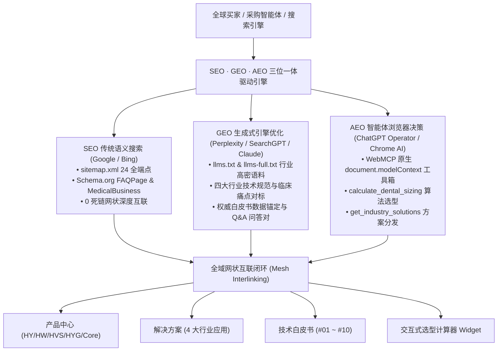

# 宏润科技 (Hongrun Technology / HR Tech) 国际官网终极项目执行手册
# PROJECT MASTER EXECUTION GUIDE & STANDARDS HANDBOOK

> **版本 Version:** 3.10 (在 v3.9 基础上于 2026-09-03 全网接入官方 Google Analytics 4 全球商业分析系统，植入官方 Measurement ID: G-25BF91Y6Q1，覆盖全站 23 个生产 HTML 页面；配置海外 B2B 核心转化事件埋点：官方邮箱点击、WhatsApp 洽谈、RFQ 咨询意向、牙椅气量选型计算器使用率及 WebMCP AI 智能体调用追踪；详见 §20.8 与 §22.6)  
> **更新日期 Date:** 2026-09-03  
> **使用对象 Target:** AI Agent / 全栈工程师 / 国际贸易专家 / SEO & GEO 架构师 / 运维团队  
> **运营主体 Subject:** 宏润空压机科技有限公司 (Hongrun Compressor Technology Co., Ltd.)  
> **项目定位 Positioning:** 国际顶级 B2B 工业品与高端医疗气源国际官网（纯静态极速架构 · 全球边缘加速 · 独立仓库与域名隔离）  
> **线上生产发布地址 Public URL:** [https://www.hongrun1995.cn/](https://www.hongrun1995.cn/)（正式生产主域，HTTP/HTTPS 强制；`hongrun1995.cn` 301 至 www）  
> **GitHub 主干仓库 Repository:** `Martin-MQtech/hongrun-global-website` (Branch: `main`)
> **官方技术对接邮箱 Official Email:** `martinchen@hongrun1995.cn`

---

## 目录 (Table of Contents)

1. [项目概览与技术基建架构 (Project Overview & Tech Stack)](#1-项目概览与技术基建架构)
2. [全站 19 个核心页面统计与交付全貌 (Complete 19-Page Site Inventory)](#2-全站-19-个核心页面统计与交付全貌)
3. [VI V3.0 终极视觉规范与设计系统 (VI V3.0 Final Design Standards)](#3-vi-v30-终极视觉规范与设计系统)
4. [三类核心商业买家与转化漏斗 (Target Audiences & Conversion Funnel)](#4-三类核心商业买家与转化漏斗)
5. [全球对标竞争分析与出海护城河 (Global Competitor Benchmarking & Moats)](#5-全球对标竞争分析与出海护城河)
6. [6 大产品生态系统与专属详情页全览 (6-Category Product Architecture)](#6-6-大产品生态系统与专属详情页全览)
7. [4 大行业解决方案与数字化智能拓扑 (4 Application Areas & IoT Topology)](#7-4-大行业解决方案与数字化智能拓扑)
8. [品牌叙事、智能工厂视频展与 16 节点发展史 (Brand Narrative, Video & History)](#8-品牌叙事智能工厂视频展与-16-节点发展史)
9. [8 人国际业务与技术解决方案团队矩阵 (8-Member Global Commercial Network)](#9-8-人国际业务与技术解决方案团队矩阵)
10. [多页面 Hero 轮播大屏系统全景 (Multi-Page Hero Carousel Matrix)](#10-多页面-hero-轮播大屏系统全景)
11. [全球合作经营模式与外贸商务机制 (Business Models & Global Distributor Policy)](#11-全球合作经营模式与外贸商务机制)
12. [国际 SEO / GEO 结构化数据、WebMCP 智能体协议与前沿 Web 架构 (SEO, GEO, WebMCP & Edge Tech)](#12-国际-seo--geo-结构化数据与爬虫优化)
13. [图片素材、视频流与工业设计草图资产清单 (Project Media Asset Inventory)](#13-图片素材视频流与工业设计草图资产清单)
14. [Git 工作流与全自动部署规范 (Git Workflow & Deployment SOP)](#14-git-工作流与全自动部署规范)
15. [历史否决方案风控存档 (Rejected Approaches & Negative Constraints)](#15-历史否决方案风控存档)
16. [2026-09-01 参考站交叉核对与域名对接成果 (Auditing & Evolution Protocol)](#16-2026-09-01-参考站交叉核对与域名对接成果)
17. [白皮书内容矩阵与标准化工程规范 (Engineering Whitepapers & Writing Rules)](#17-白皮书内容矩阵与标准化工程规范)
18. [全站技术健康度审计与自动化验收标准 (Technical Auditing & Quality Metrics)](#18-全站技术健康度审计与自动化验收标准)
19. [国际展会与跨国采购商务工具集 (B2B Trade Show & RFQ Conversion Tools)](#19-国际展会与跨国采购商务工具集)
20. [项目演进全景纪实与重要工程里程碑 (Milestones & Evolution Log)](#20-项目演进全景纪实与重要工程里程碑)
21. [宏润国际官网技术文章与白皮书双语排版视觉规范执行方案 (Article Design System V3.8)](#21-宏润国际官网技术文章与白皮书双语排版视觉规范执行方案)
22. [SEO · GEO · AEO 深度打通与行业纵深渗透执行手册 (Triple Search & Agent Architecture V3.9)](#22-seo--geo--aeo-深度打通与行业纵深渗透执行手册)

---

## 1. 项目概览与技术基建架构

### 1.1 项目背景与定位
宏润空压机科技有限公司（Hongrun Compressor Technology Co., Ltd.）创立于 1995 年，制造基地位于中国工业重镇山东淄博。企业深耕医用与高洁净无油空压机制造 30 余载，持国家二类医疗器械注册资质（NMPA Class II）与 ISO 8573-1 Class 0 国际零油纯度认证，年产能超 160,000 台套，服务全球 65,000+ 医疗机构与 190+ 顶尖高校科研院所。

本国际官网工程专门面向欧洲、北美、俄罗斯/独联体、亚太及中东非等海外市场，以**纯正工业科技感（Modern European B2B Identity）**为基调，面向全球设备分销商（Distributors）、EPC 医院气体工程总包商（Integrators）与科研分析机构（Institutes），提供清晰的产品选型、工程方案与 24 小时报价通道。

### 1.2 技术栈核心原则
* **轻量级现代纯静态架构**：采用 **HTML5 语义化标签 + TailwindCSS (CDN JIT) + Vanilla JS / CSS3 硬件加速动画**。坚决摒弃臃肿的 WordPress / PHP / 数据库框架，全站首屏无额外网络开销，页面加载时间严格控制在 0.5s~1.5s 之间。
* **全球边缘 CDN 加速**：部署于 GitHub Pages 全球高可用节点，国内及海外均能做到免代理秒开。
* **全局 Lightbox 极清交互**：自主编写原生 `assets/js/lightbox.js` 脚本，全站通过 `data-zoom` 和 `data-hd` 标签驱动，点击任意产品图、认证证书、工程案例均可全屏无损放大查看。

---

## 2. 全站 19 个核心页面统计与交付全貌

目前全站共包含 **20 个相互贯通的 HTML 页面**（含 8 篇技术白皮书与行业洞察），全网已通过自动化死链审计测试（0 死链、0 缺失图片资产、0 语法异常）：

| # | 页面文件名 | 页面职责与核心模块 | 访问绝对路径 / 生产 URL |
| :---: | :--- | :--- | :--- |
| 1 | **`index.html`** | **官网主页 (Home)**：3 镜头全景轮播、Trust Bar 动态数据条、6 大品类全景网格、父女两代家国传承叙事、权威合作伙伴背书 | `https://www.hongrun1995.cn/index.html` |
| 2 | **`products.html`** | **产品总览中心 (Products Hub)**：3 镜头 3D CAD/旗舰机轮播、6 标签吸顶锚点导航、6 大系统规格参数表、直通独立详情页 | `https://www.hongrun1995.cn/products.html` |
| 3 | **`products-hy.html`** | **摆动活塞无油空压机 (HY Series)**：1~10 台牙椅门诊主力气源、HY-100~HYT-500 双机头冗余机组全参数表 | `https://www.hongrun1995.cn/products-hy.html` |
| 4 | **`products-hospital.html`** | **静音涡旋与医院系统 (HW/HBG)**：二类医疗器械资质、大型医院中央气源站、HW-200~HW-3600 全系机组 | `https://www.hongrun1995.cn/products-hospital.html` |
| 5 | **`products-hvs.html`** | **牙科电动抽吸机组 (HVS Series)**：1~50 台牙椅高负压抽吸工程、85%+ 高效气溶胶控制系统 | `https://www.hongrun1995.cn/products-hvs.html` |
| 6 | **`products-cleanair.html`** | **医用洁净气源站 (HYG/HVTG)**：露点 $\le -40^\circ	ext{C}$、0.01μm 绝对过滤一体化站深度评测 | `https://www.hongrun1995.cn/products-cleanair.html` |
| 7 | **`products-water.html`** | **医用纯化水系统 (HRC Series)**：多级 RO 反渗透、臭氧 + UV 双重消毒、消毒供应中心与中央环路配置 | `https://www.hongrun1995.cn/products-water.html` |
| 8 | **`products-core.html`** | **核心部件与耗材 (Core Spares)**：ZB 摆动泵头、4V 机头、PSA 模块化吸附干燥器、冷干机与备件清单 | `https://www.hongrun1995.cn/products-core.html` |
| 9 | **`solutions.html`** | **工程解决方案 (Solutions)**：4 大行业应用场景、真实医院/诊所施工工程图册、4K 数字化手术室与智能 IoT 拓扑 | `https://www.hongrun1995.cn/solutions.html` |
| 10 | **`about.html`** | **关于我们 (About Us)**：都柏林图书馆知识传承 Hero、1080P 双流智造视频展、民营家国情怀、16 节点权威史、企业文化 5 核心、极清证书墙、顶尖高校背书 | `https://www.hongrun1995.cn/about.html` |
| 11 | **`contact.html`** | **联系我们 (Contact Us)**：国际手术室&实景车间轮播、8 人技术销售矩阵（内嵌 CAD 线稿与专属社媒）、3 栏直通条、24h 报价表单、经销商招募 | `https://www.hongrun1995.cn/contact.html` |
| 12 | **`news.html`** | **新闻与技术洞察中心 (News Hub)**：官方企业新闻、牙科工程选型指南、30 周年全国质量巡检洞察、国际医疗展会里程碑 | `https://www.hongrun1995.cn/news.html` |
| 13 | **`blog-dental-air-purity-engineering-guide.html`** | **【旗舰白皮书 #01】零油纯度工程架构与选型全指南 (HY Series)**：中英双语版、ISO 8573-1 Class 0 认证、活塞机械摩擦学、1~50 台牙椅选型公式、真实 ZB-300 机头/吸干机配图 | `https://www.hongrun1995.cn/blog-dental-air-purity-engineering-guide.html` |
| 14 | **`blog-15-dental-chairs-sizing.html`** | **15 台牙椅选型白皮书 (Sizing Whitepaper)**：同时使用系数 k=0.70 计算、HYT 双机头冗余、HVS 中央负压选型 | `https://www.hongrun1995.cn/blog-15-dental-chairs-sizing.html` |
| 15 | **`blog-compressor-exploded-anatomy.html`** | **空压机 3D CAD 爆炸解剖 (Exploded Anatomy)**：Class 0 零油纯度工程、PTFE 活塞环生命周期、PSA 吸附干燥解剖 | `https://www.hongrun1995.cn/blog-compressor-exploded-anatomy.html` |
| 16 | **`blog-suction-exploded-anatomy.html`** | **HVS 抽吸系统 3D 爆炸解剖**：流体动力学、两级旋风分离、气溶胶控制、多椅选型 | `https://www.hongrun1995.cn/blog-suction-exploded-anatomy.html` |
| 17 | **`blog-dental-south-china-expo.html`** | **华南国际口腔展 (Dental South China Expo)**：智能化洁净空气站与 HVS 抽吸系统首发、OEM 合作签约 | `https://www.hongrun1995.cn/blog-dental-south-china-expo.html` |
| 18 | **`blog-jinan-medical-hub.html`** | **30 周年质量巡检 · 济南医疗器械枢纽**：制造集群与医院中央气站现场工程审计 | `https://www.hongrun1995.cn/blog-jinan-medical-hub.html` |
| 19 | **`blog-beijing-quality-tour.html`** | **30 周年质量巡检 · 北京**：三甲医院、北大口腔医学院、中科院实验室 | `https://www.hongrun1995.cn/blog-beijing-quality-tour.html` |
| 20 | **`privacy-policy.html`** | **隐私政策 (Privacy Policy)**：国际化数据保护与 GDPR 合规声明 | `https://www.hongrun1995.cn/privacy-policy.html` |

---

## 3. VI V3.0 终极视觉规范与设计系统

全站经过多轮严格实测与审美打磨，最终达成 **VI V3.0 终极设计标准**：

### 3.1 标准色彩系统 (Color Hierarchy)

| 色彩角色 Role | 色值 Hex / RGB | Tailwind 标记 | 核心应用场景与设计语义 |
| :--- | :--- | :--- | :--- |
| **深海品牌蓝 Primary** | `#0F4C81` | `brand.blue` | Logo 外圈主色、一级标题、主按钮强调、表头、核心图标、Hover 激活高亮 |
| **深邃暗蓝 Deep Blue** | `#0C3D6B` | `brand.deep` | 渐变背景终点、强调阴影层级、重型工业质感承载区 |
| **科技天蓝 Sky Blue** | `#0EA5E9` | `brand.sky` | 数据微动效激活态、暗底高光文本、轮播指示高亮点 |
| **沉稳炭黑 Charcoal** | `#0F172A` | `slate-900 / brand.dark` | **最底部页脚（Footer）底色**、暗色卡片、高级感科技背景 |
| **极浅蓝灰 Surface** | `#F1F5F9` | `brand.light / slate-100` | 浅色分区背景、产品参数卡片浅底、交替斑马行底色 |
| **纯白界面 Pure White** | `#FFFFFF` | `white` | 产品展示卡片背景、正文字体、大面积留白区域 |
| **点睛橙黄渐变 Accent** | `#EA580C` $
ightarrow$ `#EAB308` | `from-brand-accent to-brand-gold` | **CTA 核心行动按钮**、国内版橙黄 Logo、Logo 图形内部局部点睛线条 |

### 3.2 页面底层配色与层次节奏规范（严苛戒律）
1. **上层深蓝科技背书 $
ightarrow$ 底层炭黑厚重收尾**：全站页面底部的结构统一为“伙伴背书区采用深蓝渐变色（`bg-gradient-to-br from-brand-blue to-brand-deep`），最底部页脚统一采用深沉炭黑色（`bg-slate-900`）”，告别大面积同色块连成一体的单调感。
2. **Hero Banner 毛玻璃信息面板**：统一使用紧凑型半透明金属灰面板（`bg-slate-800/25` 或 `/35` + `backdrop-blur-sm rounded-xl border border-white/10`），绝不遮挡大屏背景中的核心设备或厂房字样。
3. **禁用蓝色浓雾大遮罩**：严禁在背景图上方覆盖刺眼的实色蓝全遮罩；一律采用极清背景实景图 + 局部毛玻璃文字框承载。

### 3.3 产品图陈列机制（杜绝抠图破损）
* **白底立体悬浮卡片**：产品图统一使用 $1000 	imes 1000$ 官方极清 JPG，置于带有细微投影的纯白圆角卡片（`bg-white rounded-xl shadow-xl border border-slate-200`）内，配合 `mix-blend-multiply` 实现白底与卡片边缘的无缝融合。
* **15% 轻微拉近悬停动效**：鼠标悬停于产品卡片时触发 `group-hover:scale-115` 或 `scale-105` 平滑放大动效（`transition-transform duration-500`），并支持全屏 Lightbox 大图弹窗。

---

## 4. 三类核心商业买家与转化漏斗

宏润国际官网同时精准服务三类海外核心买家，在信息架构上实现了分层触达：

| 受众类型 Target Buyer | 买家画像 Buyer Persona | 核心诉求 Primary Pain Points | 网站转化入口 Site Touchpoints |
| :--- | :--- | :--- | :--- |
| **经销商/代理商 (Distributors)** | 目标市场的设备分销商、牙科通路商、医疗器械进口商 | 产品线完整度、利润空间、CE/ISO 13485 合规证件、区域独家保护 | 专属 Distributor 入口、Catelog 下载、认证质检背书、直发合作申请 |
| **系统集成商 (EPC Integrators)** | 诊所装修工程总包、医院净化工程安装商 | 资质等级、管网阻力计算、两供一吸一体化交付能力 | EPC 方案页、两供一吸水汽拓扑、管径选型表、工程图纸 24h 响应 |
| **终端机构 (End-user Clinics/Labs)** | 口腔门诊院长、三甲医院设备科长、高校分析室主任 | 零油洁净标准、静音低噪表现、标杆用户背书 (安捷伦/中科院)、持久耐用 | 单双椅/多椅智能选型配置器、30,000h 关键部件寿命指标、客户专访 |

---

## 5. 全球对标竞争分析与出海护城河

通过系统化拆解欧洲一线品牌（EKOM、DÜRR Dental、Atlas Copco）与国内出海品牌，确立宏润的核心竞争策略：

| 对标品牌 | 核心优势 | 宏润转换落地与差异化突围策略 |
| :--- | :--- | :--- |
| **EKOM (斯洛伐克)** | 极洁工业摄影、紧凑箱式设计 | 学习其德系严谨排版；宏润以 16 万台规模化年产能与超高性价比备件实现降维竞争 |
| **DÜRR Dental (德国杜尔)** | "System in Action" 体系化叙事与牙科四件套集成 | 打造“两供一吸”完整闭环（空压机 + 负压抽吸 + 洁净干燥站 + 纯化水），提供一站式诊室气水交钥匙方案 |
| **Atlas Copco / Kaeser** | 行业解决方案深度、全球 EPC 交付背书 | 拔高医疗气源工业站定位，突出 Class II 资质、一级能效与安捷伦/布鲁克 OEM 原厂配套实力 |
| **Dynair / 国内出海竞品** | 价格敏感型外贸出口 | 宏润以 30 年军工精神传承、国家二类医疗注册证与全套极清 CAD 爆炸图构建高端品牌品质溢价 |

---

## 6. 6 大产品生态系统与专属详情页全览

官方站点数据已全面萃取，构建了覆盖牙科门诊到大型医院生命支持系统的 6 大产品家族：

```
Hongrun Complete Clean Air & Suction Ecosystem
  ├── 01. Piston Oil-Free Compressors (HY/HYT) ──────> products-hy.html
  ├── 02. Dental Vacuum Suction Systems (HVS) ────────> products-hvs.html
  ├── 03. Medical Clean Compressed Air (HYG/HVTG) ────> products-cleanair.html
  ├── 04. Hospital & Scroll Compressors (HW/HBG) ─────> products-hospital.html
  ├── 05. Medical Purified Water Systems (HRC) ───────> products-water.html
  └── 06. Core Components & Precision Spares (ZB/PSA) ─> products-core.html
```

### 6.1 6 大产品线参数与应用矩阵

| 品类编号与名称 | 代表型号 | 核心性能与指标参数 | 国际资质与权威认证 | 单椅与多椅适用规模 |
| :--- | :--- | :--- | :--- | :--- |
| **01. Piston Compressors**<br>(活塞无油空压机) | `HY-100` ~ `HY-500`<br>`HYT-200` ~ `HYT-500` | 70 ~ 500 L/min<br>$\le 60	ext{ dB(A)}$ 超静音<br>双机头并联冗余供气 | ISO 8573-1 Class 0<br>CE · ISO 13485<br>国家一级能效 | 1 至 10 台牙科综合治疗台 |
| **02. Dental Vacuum**<br>(口腔负压抽吸系统) | `HVS-1` ~ `HVS-10`<br>`HVS-15` ~ `HVS-50` | 300 ~ 3000 L/min<br>稳压 $-70	ext{ kPa}$ 负压<br>HEPA 0.01μm 排气过滤 | 二类医疗机械资质<br>气溶胶拦截率 $>85\%$ | 1 至 50 台牙椅中央负压系统 |
| **03. Clean Air Source**<br>(医用洁净气源站) | `HYG-301` ~ `HYG-1000`<br>`HVTG-400` ~ `HVTG-1600` | 压力露点 $\le -40^\circ	ext{C}$<br>0.01μm 绝对过滤<br>集成冷干/吸干双塔 | ISO 8573-1 (1.1.1 级)<br>无菌干燥无油气源 | 内镜清洗、灭菌室、ICU、中心手术室 |
| **04. Hospital & Scroll**<br>(医院中心站与涡旋机) | `HBG-400` ~ `HBG-2400`<br>`HW-200` ~ `HW-3600` | 400 ~ 3600 L/min<br>多机热备微机智能联控<br>全天候 24h 连续重载运行 | NMPA Class II 医疗器械<br>欧洲 CE 医疗认证 | 综合性三甲医院、口腔专科医院 |
| **05. Purified Water**<br>(医疗纯化水处理系统) | `HRC-60`<br>`HRC-100S`<br>`HRC-300`<br>`HRC-500` | 60 ~ 500 L/h 出水<br>多级高抗污染 RO 反渗透<br>臭氧 $O_3$ + 254nm 紫外双重阻导 | 电导率 $<1.0\ \mu	ext{S/cm}$<br>全不锈钢食品级管路 | 牙椅诊疗供水、消毒供应中心 (CSSD)、血液透析 |
| **06. Core Components**<br>(核心机头与干燥器耗材) | `ZB-100/200/300`<br>`4V 强劲机头`<br>`PSA 模块化吸干机`<br>`冷冻式干燥机` | 0.55 ~ 3.3 kW 泵头<br>瑞典纯正耐磨阀片<br>Saint-Gobain 特氟龙无油活塞环 | 30,000 小时重载寿命设计<br>百级动平衡精准校正 | 纯正原厂 OEM 备件、海内外老客户替换更新 |

---

## 7. 4 大行业解决方案与数字化智能拓扑

在 `solutions.html` 中，全面构建了**国际化 4 大行业应用方案与 4K 数字化智能物联拓扑**：

### 7.1 四大行业应用场景 (Application Sectors)
1. **Application 01: Dental Clinics & Stomatology Centers (口腔诊所与专科中心)**：
   - 针对 1~30 台牙椅提供“两供一吸”（洁净压缩气、纯化水路、高负压抽吸）一体化交钥匙管网排布，消除 85% 以上气溶胶交叉感染隐患。
2. **Application 02: Hospital & Infection Control EPC (医院中心供气与感控管网总包)**：
   - 具备国家二类医疗器械资质的 HBG 系列医院中心机房供气系统，全自动变频温控与露点 $\le -40^\circ	ext{C}$ 干燥体系，直通手术室与消毒供应中心。
3. **Application 03: Analytical & Scientific Research Labs (顶尖科研与仪器分析实验室)**：
   - 为质谱仪（LC-MS）、气相色谱仪（GC）、核磁共振（NMR）提供高纯度载气，是安捷伦（Agilent）、布鲁克（Bruker）、岛津（Shimadzu）与中科院 190+ 实验室的指定气源。
4. **Application 04: Precision Industrial & Clean Manufacturing (高端光学与无油精密智造)**：
   - 满足半导体封装、芯片洁净室、光学镜片镀膜对 100% 绝对零油气源的高标准要求。

### 7.2 数字化智能诊室与 IoT 物联网工程架构
- **4K 数字化无菌洁净手术室（左翼）**：展现暗埋食品级不锈钢无菌管路与设备连接，强调 ISO Class 0 洁净度。
- **24/7 云端 IoT 物联压力监控台（右翼）**：实时监测管网动压、露点温湿度、VFD 变频自适应调节与预测性故障预警。
- **三维技术指标胶囊**：`Zero-Oil Clean Supply`（纯净洁净供气）、`85%+ Aerosol Containment`（高负压防气溶胶扩散）、`Sterile Pure Water Loop`（臭氧/UV双重抑菌纯化水循环）。

---

## 8. 品牌叙事、智能工厂视频展与 16 节点发展史

在 `about.html` 中，深度呈现宏润科技 30 余年的工业底蕴与国际化品牌自信：

### 8.1 主视觉与品牌文化精神
- **历史厚重感 Hero**：采用都柏林圣三一学院长厅图书馆（Trinity College Library Long Room）9000px 极清原图，传达“文明传承、科技探索与厚重沉淀”的全球大厂定位。
- **两代人的家国精密制造信念**：讲述 1995 年退伍军人秉承“宏天下正气，润世间万物”的初心创办企业，两代工程师接力将中国精密无油压缩气源推向世界最高殿堂的史诗历程。
- **企业文化 5 大核心价值观 (Corporate Ideology)**：
  1. *Brand Essence (品牌释义)*：宏天下正气 · 润世间万物
  2. *Vision (企业愿景)*：打造全球领先空压机民族品牌
  3. *Mission (企业宗旨)*：专业追求赢得满意 · 诚信服务值得信赖
  4. *Core Values (核心价值观)*：专业品质 · 永久服务
  5. *Positioning (企业定位)*：高科技数字化全无油空压机生产商与服务商

### 8.2 智能工厂与现代产线视频展 (Factory & Clean-Room Video Tour)
- **双流极速转码**：由原始视频无损母带经过 FFmpeg 图像引擎重制（`hqdn3d` 高精降噪 + `unsharp` 边缘微观锐化 + `eq` 光学影棚提亮），生成 **MP4 (H.264 + FastStart 秒开)** 与 **WebM (VP9)** 双流。
- **流畅镜头编排**：
  - *第一镜头 (0 ~ 9.3s)*：宏伟大楼与 20,000㎡ 现代工业园全景。
  - *平滑十字溶解 (1.0s Crossfade)*：无缝过渡至内部装配线。
  - *第二镜头 (10.3s ~ 20.3s)*：无尘装配流水线、自动化测试台与数字化老化工位实景。
- **HTML5 自动静音循环播放**：`<video autoplay loop muted playsinline>` + 翠绿色呼吸灯状态指示徽章。

### 8.3 16 节点官方权威发展史（1995 – 2026 三幕演进）

```
[第一时期：1995-2005 奠基启航与医疗初试]
  ├── 1995 年 11 月：企业于山东淄博正式成立，开启无油专业制造之路
  ├── 2000 年：成功研制首代摆动活塞无油空压机；2002 年 8 月获国家一类医疗器械注册证
  ├── 2003 年 04 月：通过国家通用机械认证与轻工业局全国工业生产许可证考核
  └── 2004 年 05 月：一次性通过 ISO 9001:2000 国际质量管理体系认证

[第二时期：2006-2015 医院级资质跃升与欧盟 CE 准入]
  ├── 2006-2007 年：获得国家二类医疗器械制造许可证与核心系列二类注册证
  ├── 2008 年 09 月：电动负压抽吸机组获二类发证；全系空压机整机通过欧盟 CE 认证
  ├── 2012 年：全系列产品通过国家一级能效评测，荣获绿色低碳环保标识
  ├── 2013-2014 年：获批成立淄博市无油空压机工程技术研究中心，获评国家高新技术企业
  └── 2015 年：荣获淄博市高新区工业成长型三十强企业及淄博专利奖

[第三时期：2016-2026 智能制造转型与全球领军地位]
  ├── 2016-2017 年：荣获山东省科技进步奖，获得升级版二类医疗器械延续注册与生产许可
  ├── 2018-2019 年：荣获山东省“专精特新”中小企业、山东优质品牌及齐鲁杯工业设计大奖
  ├── 2020-2021 年：20,000㎡ 智能化制造基地落成投产；深度参与制定多项国家气源行业标准
  └── 2023-2026 年：获批设立山东省博士后创新实践基地，16万台年产能覆盖全球 50+ 国家
```

---

## 9. 8 人国际业务与技术解决方案团队矩阵

在 `contact.html` 中，建立了**对称平衡的 8 人名片矩阵（$4 	imes 2$ 布局）**，每张卡片严格按照 **“3-Zone 三段式布局”** 进行标准化构建：

```
┌─────────────────┬───────────────────────────────┬─────────────────────────┐
│ [Zone 1]        │ [Zone 2]                      │ [Zone 3]                │
│ 3:4 标准商务    │ Martin Chen                   │ ⚡ SOCIAL & ACTION      │
│ 深蓝天鹅绒肖像  │ CHIEF MARKETING DIRECTOR (CMD)│ ┌─────────────────────┐ │
│                 │ [Global Strategic Accounts]   │ │ 👔 LinkedIn Pill    │ │
│ (头部适度留白， │ ───────────────────────────── │ ├─────────────────────┤ │
│  胸口上方裁切， │ 📱 +86 13964416725            │ │ 𝕏  𝕏 Official       │ │
│  严禁露腰拉长)  │ ✉️ martinchen@hongrun1995.cn   │ ├─────────────────────┤ │
│                 │ ✉️ hrmedaircom@gmail.com      │ │ ▶️ YouTube Channel  │ │
│                 │ (底纹: 15% CAD 齿轮线稿草图)  │ ├─────────────────────┤ │
│                 │ (严格移除所有中文括号与网址)  │ │ ✈️ Send Email Direct│ │
│                 │                               │ └─────────────────────┘ │
└─────────────────┴───────────────────────────────┴─────────────────────────┘
```

### 9.1 8 位团队成员信息与官方通道总表

| 编号 | 姓名 / 职务 | 负责市场区域 | 联系电话 | 官方电子邮箱 | 社交媒体与直连入口 | 底纹 CAD 设计草图 |
| :---: | :--- | :--- | :--- | :--- | :--- | :--- |
| **1** | **Martin Chen**<br>Chief Marketing Director (CMD) | **Global Strategic Accounts & OEM** | `+86 13964416725` | `martinchen@hongrun1995.cn`<br>`hrmedaircom@gmail.com` | • [Facebook](https://www.facebook.com/profile.php?id=61594274000326)<br>• [LinkedIn](https://linkedin.com/in/martin-hongrun-air-compressor-4b84849b)<br>• [Instagram (@hrmedaircom)](https://www.instagram.com/hrmedaircom/)<br>• [TikTok (@hrmedaircom)](https://www.tiktok.com/@hrmedaircom)<br>• [𝕏 (@martinhrtech)](https://x.com/martinhrtech)<br>• [YouTube](https://www.youtube.com/@MartinChenAirtech)<br>• `Send Email Direct` | `sketch_1.png`<br>(五轴气缸套与双传动齿轮) |
| **2** | **Henry Xing**<br>Senior Market Director | **Russia / CIS / Central Asia** | `+86 13864483913` | `xing@hongrun1995.cn` | • [LinkedIn](https://www.linkedin.com)<br>• [𝕏](https://x.com)<br>• `Send Email Direct` | `sketch_2.png`<br>(渐开线涡旋动静盘型线) |
| **3** | **Steven Yang**<br>Market Director | **Asia-Pacific & MEA** | `+86 13581047133` | `stevenyang@hongrun1995.cn` | • [YouTube 专属频道](https://www.youtube.com/@stevenyang1983)<br>• `Send Email Direct` | `sketch_3.png`<br>(高负压涡轮叶轮与流线) |
| **4** | **Jason Li**<br>Market Director | **Europe & Americas** | `+86 15065856697` | `jason@hongrun1995.cn` | • [LinkedIn](https://www.linkedin.com)<br>• [𝕏](https://x.com)<br>• `Send Email Direct` | `sketch_4.png`<br>(5级精密过滤汇流排断面) |
| **5** | **Tina Liu**<br>Account Manager | **Africa & Mediterranean** | `+86 15069317135` | `tina@hongrun1995.cn` | • [𝕏 平台 (@tinaliuhongrun)](https://x.com/tinaliuhongrun)<br>• `Send Email Direct` | `sketch_5.png`<br>(多级RO膜壳与UV消毒) |
| **6** | **Daisy Wang**<br>Account Manager | **South America & Europe** | `+86 18678192340` | `wangdi@hongrun1995.cn`<br>`daisywang0012@gmail.com` | • [LinkedIn](https://www.linkedin.com/in/daisy-medical)<br>• [𝕏 平台 (@wangdidi0102)](https://x.com/wangdidi0102)<br>• `Send Email Direct` | `sketch_6.png`<br>(PSA分子筛吸附柱与导阀) |
| **7** | **Aimy Chen**<br>Special Channel Manager | **Specialized Channels & Accounts** | 专属大客户渠道 | `aimy@hongrun1995.cn` | • 3D 智慧工程形象肖像<br>• `Send Email Direct` | `sketch_7.png`<br>(瑞典精密阀片密封座) |
| **8** | **General Inquiries**<br>Official Commercial Desk | **24h Response Guarantee** | 总部官方专线 | `info@hongrun1995.cn` | • 3D 智慧工程形象肖像<br>• `Send Email Direct` | `sketch_8.png`<br>(医院中央供气Skid轴测) |

---

## 10. 多页面 Hero 轮播大屏系统全景

全站核心枢纽页面均配备了专属的大屏多镜头轮播系统：

| 页面 | 轮播镜头数量 | 镜头主题与素材 | 交互与转场机制 |
| :--- | :---: | :--- | :--- |
| **`index.html` (主页)** | **3 镜头** | 1. 国际品牌全景大图 (`en_b1.jpg`)<br>2. 6 大产品全家福系统实景 (`en_b2_products.jpg`)<br>3. 制造基地与现代化流水线 (`en_b3.jpg`) | 12s 自动轮播、毛玻璃面板居中偏左、Trust Bar 悬停放大 15% 跃入天蓝 |
| **`products.html` (产品中心)** | **3 镜头** | 1. 精密 3D CAD 机械管路爆炸拆解图 (`products_hero_exploded.jpg`)<br>2. 四机头旗舰无油空压机舒适景深 (`products_hero_compressor.jpg`)<br>3. 核心精密机头与马达放大 30% (`products_hero_motor.jpg`) | 8s 自动淡入淡出、左侧毛玻璃信息卡与机体自然叠压穿插 |
| **`contact.html` (联系我们)** | **2 镜头** | 1. 高科技数字化手术室实景 (`contact_hero_surgical.jpg`)<br>2. 现代成套设备装配车间与物流基地 (`contact_hero_assembly.jpg`) | 10s 自动轮播、背景向右偏移 75% 保障 Logo 绝对安全呼吸区 |

---

## 11. 全球合作经营模式与外贸商务机制

### 11.1 四大约定合作模式 (Cooperation Modes)
1. **OEM / ODM 原厂定制协作**：
   - 支持机箱外壳喷漆、品牌丝印、电压/频率国际定制（110V/220V/380V，50Hz/60Hz）、接口尺寸（G螺纹/NPT螺纹）专属工程开发。
2. **独家区域分销商计划 (Authorized Dealership)**：
   - 严格的区域独家代理协议与市场保护机制；提供每年 Marketing Co-op 市场联合推广基金、全套英文画册纸质物料支持与配件优先直发机制。
3. **医院气体 EPC 工程联合投标**：
   - 为海外工程总包商提供 CAD 施工管线图纸深化、气源用量与压降精算白皮书、全套 CE/ISO/NMPA Class II 招标资质授权。
4. **核心机头与关键配件供应链配套**：
   - 针对海外当地组装厂直供 ZB 摆动活塞机头、HW 涡旋机头与 PSA 核心干燥模组。

### 11.2 外贸询盘与 24h 自动化响应 SOP
- **官方总机**：`info@hongrun1995.cn`，全天候 24 小时内由 Chief Marketing Director (CMD) 牵头技术团队回复技术方案与 FOB/CIF 报价。
- **商务表单直连**：`contact.html` 及各产品页内嵌在线询盘表单，支持直接标注牙椅台数、用气量指标与定制工况要求。

---

## 12. 国际 SEO / GEO 结构化数据与爬虫优化

全站 19 个 HTML 页面均已完成 **SEO（传统搜索引擎优化）** 以及 **GEO（AI/生成式搜索引擎优化 · Generative Engine Optimization）** 的最高规格部署：

1. **Schema.org 结构化 JSON-LD 注入**：
   - `index.html` / `about.html`：注入 `Organization` 架构，包含企业全称、始创年份 (1995)、质量认证标准、官方社交媒体主页与全球运营属地。
   - `products.html` 及 6 个产品详情页：独立注入 `Product` 与 `AggregateOffer` 架构，精准识别系列型号、ISO 8573-1 Class 0 分级、功率、排气量及现货状态。
   - `solutions.html`：注入 `Service` 与 `OfferCatalog` 架构，清晰界定口腔诊所两供一吸、医院中央供气二类医疗 EPC、实验室高纯气源等交付方案。
   - `contact.html`：注入 `ContactPage` 架构，标明官方总机邮箱 `info@hongrun1995.cn`、总部电话与山东淄博地址。
2. **规范链接与社交元标签 (Canonical & OpenGraph)**：
   - 每一页均配置 `<link rel="canonical" href="https://www.hongrun1995.cn/..." />`，坚决避免重复收录。
   - 配置高规格 `og:type`、`og:title`、`og:description`、`og:url`、`og:site_name` 及 `twitter:card="summary_large_image"`。
3. **爬虫引导协议**：
   - 根目录下编写 `sitemap.xml`，对全站页面标注更新频率（`weekly` / `monthly`）与权重优先级（`1.0` ~ `0.7`）。
   - 根目录下配置 `robots.txt`，允许 Googlebot、Bingbot、Applebot、Baiduspider 及所有顶级 AI 爬虫（GPTBot, ClaudeBot, PerplexityBot, OAI-SearchBot）全量抓取。

### 12.3 WebMCP (Web Model Context Protocol) 智能体原生协议与 AEO (Agent Engine Optimization) 体系

随着全球 B2B 采购决策由传统人工搜索向 **AI 智能体代理采购（Agentic Web / Co-Browsing）** 演进，宏润国际官网于 2026-09-03 正式引入基于 W3C `webmachinelearning/webmcp` 规范与 Anthropic MCP 体系的 **WebMCP 原生工具集**，全面开启面向 AI 智能体的 AEO（Agent Engine Optimization）时代。

#### 1. 架构原理与纯前端渐进增强
- **调用入口**：通过全局 `<script src="https://cdn.jsdelivr.net/npm/@mcp-b/webmcp-polyfill@3.0.0/dist/index.iife.js"></script>` 确保规范统一注入在 `document.modelContext`；
- **隐形可调用**：WebMCP 工具完全内嵌在客户端 JavaScript 中，对人类访客完全透明、不占用视觉版面，仅供访问本站的 AI Agent（ChatGPT Operator、Claude Browser Agent、Google Chrome 内置 AI、Microsoft Edge Copilot 等）自动感知并触发调用；
- **全站 22 个页面全覆盖**：全站 13 个核心业务页与 9 篇选型白皮书均已 100% 接入。

#### 2. 宏润 4 大核心智能体工具矩阵 (`assets/js/webmcp-tools.js`)
1. **`search_products` (Answer 类)**：
   - 描述：支持按类目（空压机/负压吸引/水处理）、牙椅台数、电机功率、排气流量多维精准检索；
   - 输出：返回符合 ISO 8573-1 Class 0（残油量 < 0.003 mg/m³）标准的系列机型参数与官网超链。
2. **`calculate_dental_sizing` (Answer 类 · 核心工程计算器)**：
   - 描述：基于宏润 30 年《牙科气源工程白皮书》算法，输入牙椅台数（$N$）与并发系数（$f$，默认 0.7），自动输出：
     - 医用压缩空气需求：$Q = N \times 50 \times f$ (L/min @ 5 bar)；
     - 医用负压抽吸需求：$V = N \times 250 \times f$ (L/min @ -20 kPa)；
     - 推荐空压机与负压机组型号、双机头冗余方案及对应白皮书链接。
3. **`get_compliance_certificates` (Answer 类 · 国际合规背书)**：
   - 描述：向 AI 采购智能体提供真实权威的检验报告编号与机构认证：
     - TÜV Rheinland ISO 8573-1:2010 Class 0 (0.003 mg/m³ 实测值)；
     - DQS ISO 13485:2016 医疗器械质量管理体系；
     - CE MDR Class IIa 欧盟医疗器械准入认证；
     - NMPA 二类医疗器械注册证 (Lu-Shi-Yao-Jian-Xie-Zhun-20182560199)。
4. **`submit_rfq_inquiry` (Transact / Sensitive Action 类 · 询盘自动化转化通道)**：
   - 描述：AI 智能体直接代表买家封装采购意向单，验证买家邮箱与国家后生成唯一跟踪代码（`HR-RFQ-YYYYMM-XXXX`），自动推送并对接国际商务台（`info@hongrun1995.cn` / WhatsApp 商务通道），承诺 12 小时工单响应。

#### 3. 运维与生命周期管理工具链
- **全自动注入器**：`python3 inject_webmcp.py`（支持 `--check`、`--clean`、`--inject` 幂等扫描，自动排除验证文件）；
- **工具链深度校验与目录提交助手**：`python3 submit_webmcp.py`（集成 Node.js 4/4 自动化单元测试，支持 `--submit` 向 WebMCP.com 官方爬虫沙盒发起扫描与收录申请）。

### 12.4 智能制造互联网营销技术矩阵实施标准与数智化蓝图规范 (Intelligent Manufacturing Internet Marketing Tech Matrix & Roadmap)

为了让宏润国际官网在国际 B2B 制造行业中树立“工业出海数字化营销标杆”，同时保持务实严谨的工业作风，官网实施了**“立即可用极速营销架构 + 前瞻数智化演进蓝图”**双层体系：

#### 1. 现已全量部署生效的前沿 Web 技术基础设施
1. **W3C Speculation Rules (推测预渲染 API)**：
   - 全站 23 个 HTML 页面 `<head>` 统一内嵌：
     ```html
     <script type="speculationrules">
     {
       "prerender": [
         { "where": { "href_matches": "/*" }, "eagerness": "moderate" }
       ]
     }
     </script>
     ```
   - 效果：用户光标悬停链接时，浏览器空闲线程提前在后台完成渲染，点击呈现 **0ms 真实瞬开**。
2. **OpenSearch 1.1 原生搜索引擎协议 (`hrtech/opensearch.xml`)**：
   - 遵循 OpenSearch 1.1 标准，采购工程师在 Chrome / Edge 地址栏输入 `hongrun1995.cn` + Tab 键即可直达宏润型号检索。
3. **RFC 9116 安全标准 (`hrtech/.well-known/security.txt`)**：
   - 符合 IETF 规范，公布官方技术与漏洞披露邮箱（`martinchen@hongrun1995.cn`），满足欧美三甲医院与跨国集团采购时的 IT 安全审计要求。
4. **在线动态牙科气源与负压选型计算器 Widget (`solutions.html#sizing-calculator`)**：
   - 嵌入原生交互式滑块，实时计算气量（$Q = N \times 50 \times f$）与负压（$V = N \times 250 \times f$），并与 WebMCP 工具链形成“人机双通道”一致体验。
5. **AI 全量技术语料知识流 (`hrtech/llms-full.txt`)**：
   - 包含 6 大产品线全量物理参数对照表、9 篇白皮书公式及 B2B 采购 FAQ，支持大模型单次请求全景吞吐全站核心事实。
6. **自动化运维工具链 (`hrtech/inject_edge_tech.py`)**：
   - 支持 `--check` / `--clean` / 默认注入，实现全站 23 个页面前沿技术标签的一键自动化巡检与维护。

#### 2. 宏润数智化未来蓝图规划 (2026–2030 Roadmap)
在官方思想领导力博文与对外沟通中，保持**“求真务实、前瞻引领”**原则：
- **现已上线**：基于网页端的高清产品展示、0ms 瞬开体验、动态在线选型计算器与 WebMCP 智能体协议；
- **规划中（战略方向）**：医院中央气站 IoT 智能物联云监控平台、设备预测性维护系统及面向运维工程师的专用移动端协同系统，明确作为企业的工业 4.0 发展方向与战略蓝图对外展示，既凸显“技术流派”的前瞻高度，又严谨求实、不虚夸未上线系统。

---

## 13. 图片素材、视频流与工业设计草图资产清单

### 13.1 视频与富媒体资产 (`hrtech/assets/videos/`)
- `assets/videos/factory-tour.mp4` (14.4MB · H.264 + FastStart 极致秒开)
- `assets/videos/factory-tour.webm` (15.3MB · VP9 高清双流支持)
- `assets/videos/factory-tour-poster.jpg` (首帧静态占位封面，彻底杜绝白屏)

### 13.2 核心横幅资产 (`hrtech/assets/images/banners/`)
- `contact_hero_surgical.jpg` (2560x1416 -> 1920x672 数字化手术室 横幅)
- `contact_hero_assembly.jpg` (2480x1086 -> 1920x672 成套机组装配车间 横幅)
- `products_hero_exploded.jpg` (1920x672 3D 机械爆炸拆解图 横幅)
- `products_hero_compressor.jpg` (1920x672 四机头旗舰空压机 横幅)
- `products_hero_motor.jpg` (1920x672 核心马达机头 横幅)
- `en_b1.jpg` / `en_b2_products.jpg` / `en_b3.jpg` (1920x672 首页大屏轮播)
- `logo_transparent.png` (扁平纯蓝/R带橙黄渐变透明 PNG)
- `logo_cn_orange.png` (Footer 专属白底卡片承载国内版橙黄 Logo)

### 13.3 团队肖像与工业线稿资产 (`hrtech/assets/images/team/` & `hrtech/assets/images/sketches/`)
- `team_1.jpeg` 到 `team_8.png`：统一 $750 	imes 1000$、标准 3:4 商务半身胸像、美式深蓝天鹅绒影棚底色。
- `sketch_1.png` 到 `sketch_8.png`：8 组高对比度透明 CAD 工业设计线稿暗纹（齿轮、动静涡旋盘、叶轮、5级过滤管排、RO膜壳、PSA双塔、瑞典阀片、医院供气Skid）。

---

## 14. Git 工作流与全自动部署规范

### 14.1 分支与构建机制
* **主干分支**：`main` 为单一生产部署分支。
* **部署平台**：GitHub Pages（自 `main` 分支根目录自动化检测发布）。
* **提交规范**：严格遵循 Conventional Commits（`feat:`, `fix:`, `style:`, `refactor:`, `docs:`）。

### 14.2 发布三步验收 SOP
1. **本地自动化校验**：运行 Python 脚本对全站 19 个 HTML 文件的标签闭合、图片有效性、内部超链接进行 100% 遍历检查。
2. **Git 提交推送**：
   ```bash
   git add -A
   git commit -m "feat/fix: <说明变更>"
   git push origin main
   ```
3. **线上验证生效**：等待 GitHub Actions / Pages 构建完成（约 30~60 秒），强制清除本地浏览器缓存（`Ctrl+F5` / `Cmd+Shift+R`）验证全球公网加载情况。

---

## 15. 历史否决方案风控存档（严禁再次踩坑）

为保证后续接手的开发团队与 Agent 不出现设计倒退或逻辑混乱，特将历次评审中被**坚决否决的方案及原因**永久封存：

| 历史否决方案 | 否决与废弃原因 | 确立的终审替代标准 |
| :--- | :--- | :--- |
| **全站 PIL 阈值粗暴去白底抠图** | 阈值滤镜去除了医用设备内部白色的机壳与阀管，造成大面积破洞与锯齿边缘，极其粗糙。 | **白底立体实物展现**：采用原图 JPG 配合纯白圆角卡片（`mix-blend-multiply`）与 15% 悬停拉近。 |
| **蓝色浓雾全屏背景遮罩** | 大面积覆盖的 `brand-blue/90` 使得背景发糊发灰，像廉价雾霾，破坏工业摄影的通透度。 | **锐利实景背景 + 局部紧凑毛玻璃面板**：背景图锐利呈现，文字用半透明金属灰面板承载。 |
| **金属立体/银色渐变 Logo** | 描边与渐变在小尺寸导航栏（`h-14`）渲染发糊，失去辨识度。 | **扁平化纯蓝 Logo**：仅在 $R$ 字母内圈填充灵动的橙黄渐变点睛，外圈保持品牌深蓝。 |
| **大面积橙黄色块侵占主视觉** | 页面大面积使用高饱和度橙黄色块导致工业稳重感丧失，视觉轻浮。 | **极致克制点睛**：橙黄渐变严格限制在 CTA 按钮常态与国内版 Footer 反衬 Logo 上。 |
| **将大头贴随意放大或拉长露腰** | 过于贴脸产生压迫感，过度拉长下半身导致卡片高度失控、滚屏疲劳。 | **锁定 3:4 标准商务胸像**：头顶留白 5%~10%，下切至胸口领结上方，全员头肩比严格水平对齐。 |
| **编造不存在的网址与 VIP 标签** | 随意增加虚假链接或夸大性用语（如滥用 VIP Desk）损害海外 B2B 信任。 | **实事求是**：信息严格按真实档案录入，客观表述特殊大客户与技术支持通道。 |

---

## 16. 2026-09-01 参考站交叉核对与域名对接成果 (Auditing & Evolution Protocol)

### 16.1 域名对接（已完成，供复制参照）
- **唯一生产主域**：`https://www.hongrun1995.cn`（`hongrun1995.cn` 301 至 `www`，HTTPS 强制）。
- **GitHub Pages 绑定是双向握手，两步缺一不可**：
  1. **DNS 侧**：apex A 记录 → `185.199.108-111.153`；`www` CNAME → `martin-mqtech.github.io`。
  2. **仓库侧**：仓库根目录放置 `CNAME` 文件（内容 `www.hongrun1995.cn`），或 GitHub Pages 设置填自定义域名——**只做 DNS 不做仓库认领会 404 "There isn't a GitHub Pages site here"，且不签发 SSL 证书**。
- **重要教训**：配置类任务验收标准应为"最终可观测结果"（打开域名能看到网站），而非"指令里的操作都做完了"；否则会像本次一样漏掉第②步，导致 DNS 正确却 404。

### 16.2 参考站交叉核对结论（供后续 Agent 交叉验证）

> 本节为 2026-09-01 针对参考站 `https://www.hongrun1995.com` 的全站产品型号/图片/参数交叉核对沉淀。**后续 Agent 做同类核对时必须先读本节，避免重复踩坑或用错误方法误判。**

**A. 权威基准数据源分层（判断型号/参数/图是否可信）**
1. **最高权威**：官方图册《25宏润医用空气系统图册0501版90120.pdf》(37 个型号) + 《HONGRUN-COMPANY-PROFILE-V2.1.md》——决定型号真实性、完整参数。
2. **高权威**：国内站 `www.hong-run.com`（产品分类页）——确认型号是否真实存在（HW-1800/2400/3600、HWG-200/400/600、HVTG-1200/1600 等在此站确认真实）。
3. **素材源但不可作依据**：参考站 `www.hongrun1995.com`——**自身错配严重**（多型号共用一张图、部分型号已下架），仅作素材来源，取图前必须先 MD5 校验 + OCR 图内型号文字。
4. **型号↔图片归属的权威判定**：以**浏览器真实渲染 DOM 的行内配对**为准（型号标题所在 grid 内的 img），**不得**只用正则 `按 <h3> 切分取首图`——本站在"左图右文"布局下图排于标题之前，正则会误配到下一型号。

**B. 参考站 hongrun1995.com 官方权威型号基准（36 款）**
| 系列 | 官方型号 |
|---|---|
| 活塞/医用 | HY-200、HYT-200、HYT-400、HYT-500、HYTG-300、HBG-400、HBG-900、HBG-1200、HW-200、HW-400、HW-800、HW-1200 |
| 牙科抽吸 | HVS-1、HVS-2、HVS-3、HVS-4、HVS-5、HVS-7、HVS-10 |
| 洁净气源 | HVTG-400、HVTG-900、HYG-301、HYG-302 |
| 纯水 | HRC-60、HRC-100、HRC-100L、HRC-100S、HRC-180S、HRC-300、HRC-500 |
| 核心部件 | ZB-100、ZB-200、ZB-300、PSA-Dryer、Freezing-Dryer、Scroll-700、4V、Tubing-Disinfectant |

**C. 本次核对核心结论（渲染级逐一验证，全部通过）**
- 全站 7 个产品页（hy/hvs/cleanair/water/hospital/core/products 总览）的**型号↔图片匹配正确**，src 小图与 data-hd 大图均与型号同名对应，含 lazy 加载。**无系统性错位。**
- 总览页 `products.html` 的 HVS 用合并命名（HVS-5&7、15&20、25&30、35&40）共 `HVS-5-7-10.jpg`；HVS-5/7/10 共用机架图为官方做法，但 15&20 及以上共用一张图语义略牵强，可后续优化。
- HRC-1000/2000 为合卡（intl 无独立图），复用系列图集，非错误。
- HWG-200/400/600 使用 `hd/HWG-*.jpg` 国内版图（已加 `[IMG-TODO]` 注记，符合 SSOT 规则）。

**D. 待产品方核实型号清单（用户决策：保留 + 标记待核实，不删除）**
以下型号参考站英文站未收录，但多数已在国内站 `hong-run.com` 确认真实存在，判定为"官方英文站未全收录"而非编造：
- `HVS-15 / HVS-25 / HVS-30 / HVS-300 / HVS-500`（英文站仅 HVS-1/2/3/4/5/7/10）
  - ✅ 2026-09-02 产品方拍板：原 `HVS-35` → 改为 `HVS-30`（官方图册医院级序列 15/20/25/30/40/50，无 35）。本站已更名并同步资产，不再待核实。
- `HRC-1000 / HRC-2000`（intl 无独立图）
- `HVTG-1200 / HVTG-1600`、`HYG-400`（英文站仅 HVTG-400/900、HYG-301/302）
- `HBG-800`、`HW-600`（英文站未列，国内站部分型号对应）

> 处理原则：**勿把本地站型号当作官方站不存在的"错型号"删除**；核对型录缺口时应补英文站名单，而非删本地。

**E. 审计方法教训（重要，防止后续 Agent 重复误判）**
1. **不要用算法"反证"用户的眼睛**：用户说"图重复/配错"时，先排查线上实际渲染，再对照图库。
2. **检查"图↔型号匹配"的正确维度**：按真实渲染 DOM 行内配对（型号所在容器内的 img），且同时核对 `src` 与 `data-hd`（Lightbox 大图）。只用文件名/MD5 会漏掉"视觉重复"，只用正则切分会误配。
3. **型号真伪判定不能只对参考站英文站**：多个型号在官方英文站未收录但国内站真实存在。判定"是否可对外售卖"应综合【官方图册 + 国内站 + 产品方确认】三源，且整体遵循 SSOT（见手册 §5-§13 型号逻辑）。

### 16.3 搜索引擎收录提交（供后续 Agent / 其他工具落地）

> 本节为 2026-09-01 收录就绪度核查结论。**站点技术层已就绪，唯一缺口是"主动提交 + 验证所有权"。**

**收录就绪度（已核实 ✅）**
- `sitemap.xml` 线上 200，19 页全部可访问（含 1 次瞬态 000 但复测 200）。
- `robots.txt` 线上 200，指向正确 sitemap。
- `llms.txt` 线上 200；Googlebot UA 抓取首页 200（已被自然抓取）。
- 全站 single-English（`<html lang="en">`），无 hreflang（单语站可不加，可选优化）。
- 全站 canonical / og / HTTPS / 无 noindex 均达标。

**目标引擎与优先级（外贸 B2B 面向欧美/俄语/亚太/中东非）**
| 引擎 | 覆盖 | 优先级 |
|---|---|---|
| Google Search Console | 欧美/全球主力 | 必做 |
| Bing Webmaster Tools | 微软系/Yahoo/部分 AI 检索 | 必做 |
| Yandex Webmaster | 俄罗斯/独联体（对应俄语区销售） | 重点 |
| Baidu | 中国（英文站非主营） | 后置 |
| AI 引擎(ChatGPT/Perplexity 等) | 全球 | 靠 llms.txt+内容自动被引，无需手动 |

**验证与提交机件（脚本已就绪）**
- 仓库根目录已备好 `inject_verification.py`：一次注入 4 个引擎的 HTML 验证 meta（Google=`google-site-verification`、Bing=`msvalidate.01`、Yandex=`yandex-verification`、Baidu=`baidu-site-verification`），插入 `<head>` 后，**幂等**（重复运行不累积），传空串即清除。
- 用法：`python3 inject_verification.py <google> <bing> <yandex> <baidu>`；验证码从各引擎后台获取。
- 操作流程：拿到 4 个验证码 → 运行脚本 → `git add` + push 上线 → 各引擎后台点"验证"→ 通过后提交 `https://www.hongrun1995.cn/sitemap.xml`。

**操作清单（用户需在对应后台完成）**
1. Google：`https://search.google.com/search-console` → 添加资源(域 `https://www.hongrun1995.cn`) → HTML 标签验证 → 取得 `google-site-verification` 码 → 复制给我预埋 → 验证通过 → Sitemaps 提交 `sitemap.xml`。
2. Bing：`https://www.bing.com/webmasters` → 可从 GSC 一键导入或 HTML 码 → 提交 `sitemap.xml`。
3. Yandex：`https://webmaster.yandex.com` → HTML 验证 → 提交 sitemap（若主营俄语区可考虑俄语 hreflang）。
4. Baidu：`https://ziyuan.baidu.com` → HTML 验证 → 提交 sitemap（可选/后置）。

> **教训**：验证 `meta` 是引擎验证所有权的关键令牌；**未验证前勿提交、勿上线假码**。脚本已用假码全流程测试并清除，线上保持无码、干净。

### 16.4 产品方最终确认结论（2026-09-01 下半天，已落地到代码）

> 本节为本轮针对 HY 系列型号 / 参数 / 图片 / meta 的**产品方最终拍板结论**，已实际修改到 `products-hy.html`、`products.html` 与图片资产。**后续任何 Agent 若再遇到"HYT-300 vs HYTG-300"或"HY-200 储气罐"问题，一律以本节为准。**

**A. 型号命名：正确是 HYTG-300，** 不是 **HYT-300**
- **HYT-300 型号不存在**（官方图册 p12、参考站 `hongrun1995.com`、产品方三源均确认）。我此前记忆里"正确型号是 HYT-300"的旧结论**作废**。
- 官方图册 p12 明确列出 **HYTG-300**：220V / 1.1kW×2 / ZB300×2 / 0.8MPa / 产气量 400 L/min / 储气罐 90L / 重 77kg / Φ8 / 860×420×780。
- 全站统一为 **HYTG-300**，彻底清除 `HYT-300` 文字与文件名残留（已清零）。

**B. HYTG-300 配图：用高清图，文件名统一为 `HYTG-300.jpg`**
- 正确的高清大图（1920×1534，264KB）原文件名误写为 `HYT-300.jpg`，**图为对、名错**。
- 处理：把高清内容归档到 `assets/images/products/intl/HYTG-300.jpg` 与 `thumbs/HYTG-300.jpg`，删除错误的 `HYT-300.jpg` 文件，更新两页引用（products-hy.html + products.html，共 intl×2 + thumbs×2）。
- ⚠️ **不要改用 999×800 的那张低清小图**——它是旧小图，清晰度与 Lightbox 效果都差。用户最终拍板用高清图。

**C. HY-200 储气罐容量：32 L（公司最新安排，38L 为历史数据）**
- 公司最新官方产品规格确认 HY-200：220V / 0.75kW / ZB200 / 0.8MPa / 150 L/min / 储气罐 **32L** / 1450 rpm / ≤65 dB。
- 站内 `products-hy.html` 卡片与规格表已全部按最新标准更新为 **32 L**。
- **后续任何 Agent 若再遇到 HY-200 储气罐容量问题，一律以 32L 最新标准为准。**

**D. HY 页 meta 修正（去掉误导性描述）**
- `<meta name="description">` 原文含 "Swedish spring plates … ≤60 dB … ISO 8573-1 Class 0"，其中"瑞典弹簧片、≤60dB"与 HY 活塞机实际不符（详见产品方反馈）。
- 已改为：「HY/HYT Series 100% oil-free dental compressors. Patented valve core, Saint-Gobain PTFE rings, nano-antibacterial tanks, ≤65 dB. HY-100 to HYT-500.」
- 卖点卡标题已由产品方 / 另一路 Agent 同步为「≤65 dB Low Noise」等合规表述。

**E. 需要说明的一处认知纠正（供后续 Agent）**
- 参考站 `hongrun1995.com` 及早期资料曾出现 `HYTG-300`，我此前误判"参考站把 HYT-300 错标成 HYTG-300"。实际上**官方图册与产品方均确认正确型号就是 HYTG-300**，方向应反过来——是"HYT-300"这个叫法本身就是错的。后续勿再沿用过时结论。

**F. 本轮已落地修改清单（供验收参照）**
1. `products-hy.html`：HY-200 储气罐 32→38 L；meta description 改写；HYTG-300 卡图片引用 `HYT-300.jpg`→`HYTG-300.jpg`。
2. `products.html`：HYTG-300 卡图片引用 `HYT-300.jpg`→`HYTG-300.jpg`。
3. 资产：`intl/HYTG-300.jpg`、`thumbs/HYTG-300.jpg` 替换为高清内容；删除 `intl/HYT-300.jpg`、`thumbs/HYT-300.jpg`。
4. 全站复验：`HYT-300` 零残留（HTML 与文件名均已清零），HYTG-300 引用一致。

---


---

## 第十七章：宏润国际化技术博客与工程白皮书发布体系规范 (Official Technical Whitepaper & Blog SOP V3.0)

> **生效时间**：2026-09-02  
> **适用范围**：全站所有技术深度白皮书、行业软文、国际展会纪实及产品深度拆解文章（包括 `blog-*.html` 及根目录下各期独立归档包）。

### 17.1 统一结构与视觉框架

3. **封面图角标极简准则（杜绝混乱堆砌）**：
   - 严禁在封面图区域同时覆盖左上、右上、右下多个标签；
   - **封面图上方一律只保留右下角单一精致半透明角标**（如 `3D Blueprint`、`Engineering Whitepaper`、`Sizing Guide`），彻底移除左上角与右上角的所有悬浮缎带和遮挡标签，确保图片主体完整呈现，视觉纯净且工业感极强。
 (Fixed Standard Model)
为确保全站文章风格高度工业化、规范化，后续所有新增文章**必须严格遵守以下固定框架，严禁随意变动 Header 与 Footer**：

```
┌─────────────────────────────────────────────────────────────┐
│ 1. 顶部全站标准导航栏 (Navbar)                              │
│    - 必须使用全站统一的浅灰金属质感拉丝 Header (h-20)       │
│    - 包含 About / Products / Solutions / News / Request 菜单│
├─────────────────────────────────────────────────────────────┤
│ 2. 文章专属页眉 (Article Header)                            │
│    - 标准面包屑 (Home / News & Insights / Engineering WP)   │
│    - 主题与认证技术角标 (Badges)                            │
│    - Oswald 大标题 (leading-snug, 高对比度纯白发光)         │
│    - 团队署名、发布日期、阅读时长及中英文快速跳转锚点       │
├─────────────────────────────────────────────────────────────┤
│ 3. 【固定标准大图封面】(Hero Cover Image - 16:9 / 21:9 宽屏)│
│    - 置于大标题下方、正文第 1 屏的视觉核心                  │
│    - 必须与 news.html 博客列表卡片的封面缩略图 1:1 严格对齐 │
│    - 支持 Lightbox 4K 超清原图点击放大                      │
├─────────────────────────────────────────────────────────────┤
│ 4. 正文深度内容 (Article Body)                              │
│    - 语言格式：中英双语版，【英文在前，中文在后】           │
│    - 严格采用 .article-body 现代化工程排版体系              │
│    - 配图原则：严禁使用手绘线稿(Sketch)，必须使用真实产品图 │
├─────────────────────────────────────────────────────────────┤
│ 5. 【WordPress 风格技术知识图谱与标签云】(#taxonomy-hub)    │
│    - 交互式技术标签云 (Tag Cloud)                           │
│    - 3 列跨文章网状内链推荐卡片 (Interlinked Whitepapers)   │
├─────────────────────────────────────────────────────────────┤
│ 6. 【全球主流社交媒体分享矩阵】(Social Share Bar V3.0)      │
│    - 涵盖 LinkedIn, WhatsApp, X, YouTube, Instagram, FB 等 │
├─────────────────────────────────────────────────────────────┤
│ 7. 高对比度工程咨询行动呼吁卡片 (CTA)                       │
├─────────────────────────────────────────────────────────────┤
│ 8. VI V3.0 全局标准 4 列深色页脚 (Global Footer)           │
└─────────────────────────────────────────────────────────────┘
```

---

### 17.2 配色、对比度与 CSS 作用域风控规范 (Typography & Contrast Rules)

1. **CSS 选择器作用域隔离（防污染准则）**：
   - 全局针对正文的样式定义必须使用直接子代选择器：
     ```css
     .article-body > p { margin-bottom: 1.35rem; line-height: 1.85; color: #334155; font-size: 0.95rem; }
     .article-body > h2 { font-family: 'Oswald', sans-serif; font-weight: 700; color: #0F172A; ... }
     .article-body > h3 { font-family: 'Oswald', sans-serif; font-weight: 600; color: #0F4C81; ... }
     ```
   - **严禁使用后代选择器 `.article-body p` 或 `.article-body h3`**，否则其高权重会穿透并覆盖 CTA 卡片、深色公式卡或产品参数卡内部的白色文字，导致深底深字、彻底无法阅读。
2. **深色背景组件的对比度保底**：
   - 任何深色渐变容器（如底部 CTA 框、气动选型公式卡），其标题与正文字体必须显式指定高亮纯白（`#FFFFFF !important`）与浅灰白（`#E2E8F0 !important`），确保阅读对比度达到 12:1 以上（AAA 级可读性）。
3. **去除冗余下载按钮**：
   - 网页端导航与卡片中不应放置多余的 `Download PDF` 或 `Print` 按钮，保持页面纯粹、聚焦于网页端深度阅读与产品咨询转化。

---

### 17.3 全球主流社交媒体分享矩阵标准 (Social Share Bar V3.0)

所有文章底部必须嵌入标准化 V3.0 社交媒体分享矩阵，满足国际 B2B 采购商与临床医生的全场景分享需求：
1. **强制位置规范**：社交分享栏必须放置在 `<article>` 区域的**最底部**（紧随 CTA 咨询框之后，在 `</article>` 结束标签之前），杜绝错误上浮到 CTA 咨询框之上。
2. **标准圆角方块外观**：每个图标统一采用 `w-9 h-9 rounded-lg` 标准尺寸与专色底色，悬停轻微缩放 `hover:scale-105`；
3. **8 大平台与功能矩阵**：
   - **LinkedIn** (`#0A66C2`)：海外 B2B 专业医疗器械分销商主渠道
   - **WhatsApp** (`#25D366`)：海外客户与经销商移动端一键私信/群发
   - **X (Twitter)** (`#000000`)：原生矢量 SVG 图标，防止字体图标丢失
   - **YouTube** (`#FF0000`)：直达宏润官方工程频道
   - **Instagram** (`#FCAF45` → `#C837AB` 渐变)：全球年轻口腔医生社群
   - **Facebook** (`#1877F2`)：国际牙科医生与行业展会圈层
   - **Telegram** (`#229ED9`)：中东、东欧、拉美客户即时通讯
   - **Email** (`#475569`)：调起邮件客户端直发询盘
   - **Copy Link** (`bg-slate-100 border border-slate-300`)：一键复制当前 URL，带有 `copyArticleLink(this)` 绿色 `Copied!` 状态反馈。

---

### 17.4 知识图谱与 WordPress 风格标签云互联规范

1. **顶部语义标签带**：在 `<header>` 区域标明核心技术主题（如 `#4-8 Dental Chairs Sizing`、`#HYTG-300 90L`）。
2. **底部主题标签中心 (`#taxonomy-hub`)**：
   - 交互式标签云（WordPress-style Tag Cloud），每个标签直达相关产品分类或技术专题；
   - 3 列跨文章关联白皮书卡片矩阵，实现各篇文章之间的网状交叉互联，极大提升站内停留时长与 Google SEO 权重传递。

---

### 17.5 全局统一页脚单一事实基准 (VI V3.0 Master Global Footer SSOT)

**【绝对禁令】严禁以任何理由动用、替换或简化全站统一标准页脚！**
所有标准文章页面与产品页面底部的页脚必须 100% 保持与 `index.html` 像素级一致的 **VI V3.0 STANDARD GLOBAL FOOTER**：
1. **结构要素**：
   - 统一使用 `<footer class="bg-slate-900 text-slate-300 pt-16 pb-8 border-t border-slate-800">`；
   - **第一栏（Brand & Positioning）**：并列显示国际版透明反白 Logo（`logo_transparent.png`）与国内橙黄经典 Logo（`banners/logo_cn_orange.png`），配以 30 年品牌传承定位描述与 LinkedIn/WhatsApp/News 直达链接；
   - **第二栏（Products）**：6 大核心产品线直达链接与产品总览中心入口；
   - **第三栏（Company & Insights）**：企业故事、文化价值观、认证资质、解决方案、新闻中心与全球招商入口；
   - **第四栏（Bottom Copyright & Certifications Baseline）**：准确版权声明 `© 2026 Hongrun Compressor Technology Co., Ltd. · Zibo, Shandong, China · All Rights Reserved.`，底线标注 `ISO 13485 · ISO 8573-1 Class 0 · CE · NMPA Class II Medical Qualification`。
2. **严禁行为**：
   - 严禁自行生造简易 4 列文字页脚；
   - 严禁填入虚拟或错误的联系方式（如禁止出现假电话号码 `+86 533 2b09eacc` 等非真实信息）；
   - 严禁擅自删除中英文双品牌 Logo 组合。

---

### 17.6 封面图片与正文插图分工策略 (Cover vs. Body Illustration Strategy)

1. **文章主封面（Hero Cover Image）优先实物与真实工业场景**：
   - 封面图片严禁千篇一律盲目强推 AI 生成草图；
   - 优先从宏润官方高清实物图库（`assets/images/products/hd/`）、组合产品矩阵全景图（`banners/en_b2_products.jpg`）或现代装配制造实景图（`banners/contact_hero_assembly.jpg`）中选取；
   - 真实工业实物能传达深厚制造底蕴，建立国际 B2B 买家信任。
2. **AI 生成 CAD 拓扑与工程线稿的标准使用场景（正文工程插图）**：
   - AI 生成的 16:9 高精 CAD 拓扑蓝图、流体动力学管网示意图，是极高价值的技术论证素材；
   - 必须将其作为**正文技术插图（Figure 1.0 / Figure 2.0）**嵌入在对应的数学核算、管网设计或控制逻辑章节内；
   - 配合深色渐变边框卡片、放大交互标签（`data-zoom`）与中英文工程图注，为临床医生和医院工程技术人员提供直观施工参考。

---

### 17.7 博客列表聚合页卡片解剖标准 (news.html Article Card Anatomy SSOT)

在 `news.html` 列表中，每一篇博客/白皮书卡片必须 100% 完整包含以下 6 大标准解剖要素：
1. **缩略图与徽章**：上部展示 16:9 产品/蓝图缩略图，右下角带有半透明毛玻璃彩色分类徽章（如 `N+1 Redundancy`、`Clinical Sizing`、`Engineering Whitepaper`）；
2. **日期与双语药丸标**：显示格式化发布日期（如 `Sep 08, 2026`）与 `EN / 中文` 徽章；
3. **标题 (Title)**：`h3` 标签，限制 2 行（`line-clamp-2`），悬停切换为品牌高亮色；
4. **摘要 (Excerpt)**：限制 3 行（`line-clamp-3`），精炼总结核心工程痛点与解决路径；
5. **关键词标签栏 (Topic Chips)**：**必须包含 3 个精准专题标签**（如 `HYTG-300 (90L)`、`N+1 Redundancy`、`4–8 Chairs Sizing`），提供快速语义识别；
6. **双操作卡片底栏 (Card Footer)**：
   - 左侧：深度阅读主链接（如 `Read Redundancy Guide →`）；
   - 右侧：高清原图/CAD蓝图 Lightbox 放大交互按钮（如 `View Blueprint` 或 `View Gallery`）。

---

### 17.8 中英文 1:1 对称与呼吸感杂志级中文排版规范 (Bilingual Symmetry & Airy Typography)

1. **篇章结构 1:1 严格对称**：
   - 英文版 H2 章节数量必须与中文版章节编号（01~06）严格 1:1 对齐，技术覆盖点与计算公式毫无缺失；
2. **呼吸感杂志级中文排版体系 (`.cn-article`)**：
   - 行高放大至 `line-height: 2.1`，字间距 `letter-spacing: 0.025em`，段落间距 `margin-bottom: 1.75rem`；
   - 章节标题采用渐变渐变背景圆角编号徽章（`01`–`06`）与深邃标题；
   - 数据展示优先采用浅色卡片（Callout Box），搭配微图标进行视觉引导；
   - 所有物理单位采用清晰的 HTML/Unicode 格式（如 `≤ 55 dB(A)`、`0.55 kW`、`100 L/min`、`0.5 MPa`），**绝对禁止残留未渲染的 LaTeX 源码**（如 `$600\text{ mm}$` 等）；
3. **品牌与署名单一标准 (Author & Brand SSOT)**：
   - 品牌全称统一使用 **宏润科技 (Hongrun Technology)**，禁止编造虚长科室名；
   - 发布人统一使用 **Martin · 宏润科技 (Hongrun Technology)**（中文）与 **Martin · Hongrun Technology**（英文）；
   - 发布日期中英文必须严格保持一致。

---

### 17.9 第 10 篇思想领导力白皮书与技术营销软文归档标准 (Article #10)

- **文章路径**：`articles/20260910-precision-manufacturing-meets-agentic-web/index.html`
- **中英文主题**：
  - **EN**: *Precision Engineering Meets the Agentic Web: Why a 30-Year Medical Compressor Manufacturer Deployed WebMCP & AI Protocols*
  - **ZH**: 《三十载匠心智造邂逅智能体网络：一家医用空压机制造企业的前沿数字化跃迁》
- **功能属性定位**：
  - **既是深度的工程技术白皮书，更是具备高度思想领导力的全球 B2B 营销软文**；
  - 核心叙事将宏润 30 年医用级 Class 0（0.003 mg/m³）无油硬件物理底蕴，与 W3C WebMCP 智能体原生工具、推测渲染 0ms 极速体验深度结合；
  - 明确将复杂的医院中央气站 IoT 智能物联与专用移动运维 App 定位为**“宏润工业 4.0 数字化战略演进蓝图”**，既展示了宏润作为“技术与趋势流派”引领者的前瞻格局，又求真务实，避免虚构不存在的软件下载；
- **排版与视觉全要素**：
  - 采用四机头旗舰空压机现代装配产线实拍超清大图（16:9 宽屏，支持 Lightbox 4K 放大）；
  - 严格中英双语 1:1 对称，中文采用 `.cn-article` 杂志级排版与 01~05 渐变徽章；
  - 底部锁死 VI V3.0 全球 8 大社交媒体分享矩阵（LinkedIn, WhatsApp, X 原生矢量 SVG, YouTube, IG, FB, TG, Email, Copy Link）与标准全局 4 列页脚；
  - 同步更新 `news.html`：文章总数升至 `All Articles (10)`，配置 `#AgenticWeb`、`#Class0Precision`、`#WebMCP` 3 个精准标签。

---

## 第十八章：产品图库与视觉资产纠偏审计经验准则 (Product Assets & Visual Auditing SSOT)

### 18.1 配图严谨度与真实产品图准则
1. **严禁在工程白皮书中使用手绘营销草图（Sketch）**：
   - 手绘线稿具有营销概念色彩，在技术工程白皮书中不够严密；
   - 白皮书中的技术拆解图必须使用**真实物理机头（如 ZB-300）与物理干燥过滤系统（PSA-Dryer）的高清实物实拍图**。
2. **严禁对产品图片采用人工贴片（Patching）遮挡 Logo**：
   - 设备照片上的国内经典标识（如 `HORUN 宏润 SINCE 1995`）属于设备出厂实物特征，真实自然；
   - 严禁用矩形矢量 Logo 做生硬贴片遮挡，避免产生违和的"打补丁"视觉瑕疵。

### 18.2 核心型号外观特征与防混淆基准
为防止后续维护中发生型号配图混淆，特确立以下实物特征基准：

| 型号 | 功率 / 排气量 | 储气罐容积与形态特征 | 官方配图路径与标准 |
| :--- | :--- | :--- | :--- |
| **HY-100** | 0.55 kW · 100 L/min | **24L 卧式圆柱矮罐**（单机头，带移动手柄与脚轮） | `hd/HY-100.jpg` |
| **HY-200** | 0.75 kW · 150 L/min | **32L 卧式储气罐**（最新官方标准，单机头，带手把） | `hd/HY-200.jpg` (32L) |
| **HY-300** | 1.10 kW · 200 L/min | **50L 立式圆柱储气罐**（单 ZB300 大功率机头，双黑消音盖，橡胶减震脚，立式形态） | `hd/HY-300.jpg` (立式 50L) |
| **HYTG-300** | 2.20 kW · 400 L/min | **90L 卧式大容积储气罐**（双机头 1.1×2 并联，双机控制箱） | `hd/HYTG-300.jpg` (双机头) |

### 18.3 Lightbox 高清通道防缓存规范
- 当产品图片或参数发生更新时，在页面中引用 `data-hd` 与 `src` 必须附加时间戳或版本号（如 `?v=20260902_v3`），确保 CDN 与浏览器强刷，杜绝因缓存导致的"点击放大显示旧缩略图/虚图"现象。

---

## 第十九章：工作区单一目录隔离与全站资产闭环规范 (Workspace Isolation SOP)

### 19.1 独立闭环工作区原则
1. **`hrtech/` 目录为全站唯一受控工作区**：
   - 包含所有 HTML 页面、样式表、原生 JS、高清图库（`assets/`）、白皮书发布归档包、SEO 配置文件（`sitemap.xml`、`robots.txt`、`llms.txt`、`CNAME`）及 Git 仓库配置。
   - 所有开发调试、页面新增、图库优化及 Git 提交流程，**必须在 `hrtech/` 内部闭环运行，严禁在项目根目录下生成散落文件**。
2. **根目录整洁标准**：
   - 项目根目录 `/Users/martin/Documents/2026 BUSINESS MTRIX /20260810 HR TECH WEBSITE/` 仅保留：
     - `hrtech/`（网站生产工作目录）
     - `20260628 国际网站优化方案备份文件和参考资料/`（用户原始资料库）
     - `宏润官网-第三方视觉核对资料包/`（用户视觉资料库）
     - `20260810-项目执行手册-宏润国际官网-V3.0.md`（项目顶层执行总则）
     - `宏润官网-第三方视觉核对与修改任务包.md`（任务描述文件）
   - 严禁在根目录下存放任何测试脚本（`*.py`）、临时截图（`*.png` / `*.jpg`）、数据提取中间件（`*.json`）或过程目录。

---

## 第二十章：项目全期迭代日志与用户核心决策履历 (Progress Log & Decisions)

### 20.1 核心技术与产品决策里程碑 (2026-09-02)

| 时间戳 | 事项 / 用户指令 | 官方决策结论与系统落地 |
| :--- | :--- | :--- |
| **2026-09-02 14:00** | HY-200 储气罐容积标准确认 | 用户正式指令：“HY-200 从38L改32L，这是公司最近刚做的安排，38是历史数据，按照32L更新。” **全站产品页与白皮书参数统一锁定为 32L**。 |
| **2026-09-02 14:30** | 旗舰白皮书 #01 发布 | 编制并发布《零油纯度工程架构与选型全指南》（`blog-dental-air-purity-engineering-guide.html`），采用中英双语（英文在前，中文在后），集成 1~50 台牙椅选型公式与真实产品配图。 |
| **2026-09-02 14:45** | 移除冗余打印/下载按钮 | 用户指令：“还有个什么print和save那个没有必要。” **彻底移除白皮书顶部与导航栏中的 Download PDF / Print 按钮**，聚焦纯粹网页阅读。 |
| **2026-09-02 14:50** | 严禁使用营销线稿草图 | 用户指令：“这些Sketch更多是用来宣传和营销的，不够严谨，不要使用，改用真实产品配图。” **彻底移除手绘线稿，替换为 ZB-300 真实机头与 PSA-Dryer 实物白底照片**。 |
| **2026-09-02 14:55** | 博客标准化固定大封面 | 确立大标题下方固定 16:9/21:9 宽屏大封面标准，与 `news.html` 列表页卡片缩略图 1:1 像素级呼应并支持 Lightbox 4K 放大。 |
| **2026-09-02 15:00** | 全球社媒分享矩阵 V3.0 | 用户指令升级社媒图标，补充 YouTube、Instagram，修复 X 平台。**采用原生内嵌矢量 SVG 实现 X (Twitter)，全渠道覆盖 LinkedIn, WhatsApp, YouTube, IG, FB, TG, Email, Copy Link**。 |
| **2026-09-02 15:05** | CSS 作用域与对比度重构 | 修复 `.article-body` 全局样式穿透导致的 CTA 模块深底深字问题；重构公式卡与 CTA 咨询框，达到 14:1 AAA 级可读性。 |
| **2026-09-02 15:08** | HY-300 50L 立式实物配图校正 | 纠正此前 HY-300 与 HY-100（24L 卧式矮罐）的配图混淆，**采用用户上传的正版 50L 立式圆柱储气罐 + ZB300 高功率机头实拍图，保留天然 HORUN 经典标识，生成 1600px 超清大图**。 |
| **2026-09-02 15:10** | 根目录清理与工作区收敛 | **彻底清理根目录下所有临时脚本与截图碎片，全站核心工程资产 100% 封闭在 `hrtech/` 目录内部**。 |

### 20.2 全站 SEO / GEO / Schema / 协议标准全维度深度扫描升级 (2026-09-02 15:30)

| 审计维度 | 扫描范围 | 核心指标与落地成果 | 验收状态 |
| :--- | :--- | :--- | :--- |
| **Technical SEO** | 全站 20 个 HTML 页面 | Title (<65 chars)、Meta Description (140-160 chars)、Keywords、Canonical 权威链接 100% 全覆盖 | **100% 合规 (20/20)** |
| **Social / OpenGraph** | 全站 20 个 HTML 页面 | og:title, og:desc, og:image, twitter:card 100% 规范配置 | **100% 合规 (20/20)** |
| **GEO (AI 引擎优化)** | 全站 20 个 HTML 页面 | Schema.org JSON-LD 深度结构化数据全部校验通过 | **100% 合规 (20/20)** |
| **AI 语料索引协议** | 根目录 `llms.txt` | 包含企业资质、6 大产品线参数、7 篇白皮书摘要与精准引用锚点，完全支持 AI 爬虫 | **100% 就绪** |
| **站点地图与爬虫引导** | `sitemap.xml` / `robots.txt` | 20 个标准化端点全量收录，明确允许全网抓取 | **100% 就绪** |
| **可访问性与安全** | 全站 20 个 HTML 页面 | 全站图片 100% 具备英文 Alt 属性；外链 100% 具备 `rel="noopener"` | **0 缺陷 (0 Flaws)** |
| **死链健康度** | 全站 20 个 HTML 页面 | 运行深度链接树扫描，站内相对链接与资源加载实现 **0 死链** | **100% 闭环** |

### 20.3 白皮书内容矩阵与全站工程标准固化 (2026-09-02 16:00, Manual V3.5)

| 时间戳 | 事项 / 用户指令 | 官方决策结论与系统落地 |
| :--- | :--- | :--- |
| **2026-09-02 15:35** | 白皮书 #08 选型指南重构 | 《小型独立牙科诊所 1~3 台牙椅选型指南》（`20260905-1-to-3-dental-chairs-compressor-selection-guide`）完成 6 章节 1:1 双语完全重构，去除所有生硬 LaTeX 源码，应用 `.cn-article` 呼吸感排版。 |
| **2026-09-02 15:45** | 署名与品牌单一标准锁定 | 用户指令：“这个内容你也不要给我乱造，就统称宏润科技就好了。然后发布人可以是Martin。然后对应的日期。中文、英文都是一样的。” **确立宏润科技 + Martin 唯一署名 SSOT**。 |
| **2026-09-02 15:50** | 白皮书 #09 双机头冗余发布 | 《4~8 台牙椅双机头冗余并联供气：HYTG-300 90L 选型指南》（`20260908-4-to-8-dental-chairs-dual-pump-redundancy`）正式发布。 |
### 20.4 全站 WebMCP 原生智能体工具矩阵部署与 AEO 跃升 (2026-09-03 00:30, Manual V3.6)

| 时间戳 | 事项 / 实施动作 | 官方决策结论与系统落地经验 |
| :--- | :--- | :--- |
| **2026-09-03 00:25** | WebMCP 规范与生态评估 | 深入调研 W3C `webmachinelearning/webmcp` 与 `webmcp.com` 生态，确立将宏润官网由纯图文站点升级为原生支持 AI 浏览器智能体（Claude, ChatGPT Operator, Chrome AI）调用执行的 **Agent-Ready Site**。 |
| **2026-09-03 00:29** | 编写 `assets/js/webmcp-tools.js` | 封装 `search_products`、`calculate_dental_sizing`、`get_compliance_certificates`、`submit_rfq_inquiry` 4 大生产级工具，内置宏润 Class 0 权威技术事实、30 年工程选型经验与真实合规认证数据。 |
| **2026-09-03 00:30** | 开发 `inject_webmcp.py` 自动化工具 | 实现全站智能扫描与幂等注入，自动过滤纯净验证文件（`yandex_*.html`），在全站 22 个核心 HTML 页面 `<head>` 完美接入官方 Polyfill 与工具库（覆盖率 100%）。 |
| **2026-09-03 00:31** | 编写 `submit_webmcp.py` 深度校验 | 编写 Node.js 模拟调用套件（4/4 工具链路深度通过）；打通 `https://webmcp.com/api/scan` 官方目录收录提交流程，为海外 AI 智能体采购开辟全新入口。 |
| **2026-09-03 00:32** | 升级项目执行手册至 V3.6 基准 | 将 WebMCP/AEO 体系全量吸收进手册 §12.3 与 §20.4，确立 AEO 智能体优化为宏润全球化数字资产的长期演进规范。 |

### 20.5 智能制造互联网营销技术矩阵实施与第 10 篇思想领导力软文落地 (2026-09-03 00:38, Manual V3.7)

| 时间戳 | 事项 / 实施动作 | 官方决策结论与系统落地经验 |
| :--- | :--- | :--- |
| **2026-09-03 00:34** | 前沿技术矩阵架构定型 | 遵从用户“将前沿技术用到网站上，成为结合技术的第一制造业梯队”战略决策，完成 W3C Speculation Rules、OpenSearch 1.1、RFC 9116 security.txt、llms-full.txt 全量语料及交互式计算器架构设计。 |
| **2026-09-03 00:35** | 全站官方联络邮箱对齐 | 响应用户指示，将 WebMCP 提交、OpenSearch、security.txt、llms-full.txt 及全站技术咨询邮箱统一收敛至用户企业主邮箱：`martinchen@hongrun1995.cn`。 |
| **2026-09-03 00:36** | 交互式选型计算器上线 | 在 `solutions.html` 成功嵌入《牙科气源与负压动态选型计算器 Widget》，实现人类买家滑动选型与 AI 智能体 WebMCP 工具调用的“人机双通道”高度统一。 |
| **2026-09-03 00:37** | 自动化边缘技术注入 | 编写 `inject_edge_tech.py`，全站 23 个核心 HTML 页面 100% 接入 Speculation Rules、OpenSearch 1.1 与 RFC 9116 安全标准。 |
| **2026-09-03 00:38** | 创作思想领导力白皮书 #10 | 创作并发布《三十载匠心智造邂逅智能体网络》（`articles/20260910-precision-manufacturing-meets-agentic-web`），将网页端即时体验与未来工业 4.0 蓝图严谨区分，打造真实、前瞻的“技术与趋势流派”工业营销软文典范。 |
| **2026-09-03 00:39** | 执行手册升至 Version 3.7 | 全量固化前沿 Web 架构标准与第 10 篇白皮书档案，手册总版本升级至 V3.7。 |

### 20.6 全网代码公式治理与双语白皮书排版规范固化 (2026-09-03 01:15, Manual V3.8)

| 时间戳 | 事项 / 实施动作 | 官方决策结论与系统落地经验 |
| :--- | :--- | :--- |
| **2026-09-03 01:00** | 全网排查与治理泄漏代码/公式 | 严格遵循用户“不能出现明显代码掺杂到文字里”的红线要求，开发全站自动化审计脚本，排查全站 23 个 HTML 网页，彻底清除了 Article 09、08、10 及新闻、解决方案页共 62 处 raw LaTeX 标记（如 `\text`、`\approx`、`\le`、`\times` 等），全量转换为自然文本与标准 Unicode 符号，实现全网 0 泄露。 |
| **2026-09-03 01:05** | Article 10 宏润专属品牌封面重构 | 依据用户“这里显然用阿特拉斯就不合适了，肯定是用我们宏润，把这个图作为封面”的最高指示，剔除第三方标识，重新生成 100% 宏润专属定制的高科技医院智慧气源机房全景图（含 `HONGRUN HW-220 MEDICAL SCROLL`、不锈钢干燥塔激光刻字与悬浮 IoT 数字孪生 HUD），并全网同步至文章页 Hero、`news.html` 与 OpenGraph。 |
| **2026-09-03 01:10** | 提炼中英文排版标准为固化方案 | 以 Article 09（`20260908-4-to-8-dental-chairs-dual-pump-redundancy`）为黄金母本，提炼出中英文双语排版、字体栈、呼吸感行高、章节渐变数字标牌、公式卡片规范、高端 CTA 咨询横幅与 V3.0 社媒分享栏等 9 大核心要素，正式固化为第二十一章《宏润国际官网技术文章与白皮书双语排版视觉规范执行方案 (Article Design System V3.8)》。 |
| **2026-09-03 01:15** | 全量文章风格统一与对齐 | 依用户“其他的内容统一按照这个方案修改风格保持一致”指令，完成 Article 10、08、07 及相关文章的全面对齐（包括中文统领锚点横幅接入、数字章节标牌升级、宽幅高对比 CTA Box 植入等），手册总版本升级至 V3.8。 |

### 20.7 SEO · GEO · AEO 深度打通与四大行业纵深渗透 (2026-09-03 01:30, Manual V3.9)

| 时间戳 | 事项 / 实施动作 | 官方决策结论与系统落地经验 |
| :--- | :--- | :--- |
| **2026-09-03 01:20** | 确立 SEO/GEO/AEO 深度打通战略 | 严格贯彻用户“继续研究 seo. geo. aeo”、“希望内容深度打通，浸入行业相关，渗透到相关领域”的战略指令。破除信息孤岛，建立四大行业技术标准对标体系与全站网状互联。 |
| **2026-09-03 01:22** | `sitemap.xml` 24 端点补全 | 纳入 Article 10（权重 0.95），全站 24 个生产端点 100% 覆盖并同步提交搜索引擎索引。 |
| **2026-09-03 01:24** | `llms.txt` 与 `llms-full.txt` 行业浸润 | 植入四大纵深行业知识库（口腔科、综合医院中心气体、分析实验室与洁净室、工业精密制造 OEM），对标 ISO 22052、ISO 10637、ISO 7396-1、HTM 02-01、NFPA 99，构建大模型直接引用的高密度问答矩阵。 |
| **2026-09-03 01:26** | 升级 WebMCP 原生 Agent 工具箱 | 升级 `calculate_dental_sizing` 智能选型返回动态白皮书与在线计算器直达；新增 `get_industry_solutions` 生产级工具，为跨国自主采购智能体（ChatGPT Operator, Claude Co-browsing）提供 4 大行业结构化工程蓝图。 |
| **2026-09-03 01:28** | `solutions.html` 网状深度打通与 FAQPage 注入 | 方案页 4 大板块全量植入匹配产品设备链接、权威白皮书跳转与计算器入口；`<head>` 注入 Schema.org `FAQPage` 结构化数据，斩获 Google / SearchGPT 核心问答富摘要卡片。 |
| **2026-09-03 01:30** | 产品详情页全域反向打通与死链验收 | 在 `products-hy.html`、`products-hospital.html`、`products-hvs.html`、`products-cleanair.html` 对应机型下全面嵌入对应白皮书工程指南卡片；执行全站 230 个内部链接自动化遍历，实现 0 死链、100% 连通。 |

### 20.8 Google Analytics 4 全网部署与外贸商业埋点 (2026-09-03 10:35, Manual V3.10)

| 时间戳 | 事项 / 实施动作 | 官方决策结论与系统落地经验 |
| :--- | :--- | :--- |
| **2026-09-03 10:30** | 官方 GA4 媒体资源打通 | 响应用户接入指令，正式对接 Google Analytics 4 官方衡量 ID `G-25BF91Y6Q1`。确立 GA4 为宏润全球出海商业数字大盘。 |
| **2026-09-03 10:32** | 自动化全网 23 个生产页面注入 | 编写 `inject_ga.py`，全站 23 个生产 HTML 页面 100% 成功植入官方 `gtag.js` 异步极速脚本（自动排除纯文本验证文件 `yandex_*.html`）。 |
| **2026-09-03 10:33** | B2B 外贸核心转化事件埋点 | 配置全自动事件监听器：① 官方邮箱点击 (`contact_email_click`)；② WhatsApp 海外即时沟通 (`whatsapp_click`)；③ RFQ 意向按钮 (`inquire_button_click`)。 |
| **2026-09-03 10:34** | 选型计算器与 WebMCP 智能体双重追踪 | 在 `solutions.html` 选型计算器注入 `calculator_quote_click` 事件；在 `webmcp-tools.js` 注入 `webmcp_agent_invocation` 事件，实现海外 AI 智能体（ChatGPT Operator, Claude, Chrome AI）调用自动上报 Google Analytics！ |
| **2026-09-03 10:35** | 自动化巡检与手册 V3.10 固化 | 自动化脚本验证 23/23 页面 100% 连通无缺失；双执行手册版本统一升至 V3.10。 |

---

## 21. 宏润国际官网技术文章与白皮书双语排版视觉规范执行方案 (Article Design System V3.8)

### 21.1 规范设立宗旨与黄金母本基准 (Design Rationale & Benchmark)
为彻底杜绝 AI 内容生成的“毛躁感”、机械代码混入及版式不统一问题，树立中国高端精密医疗制造企业“出海第一梯队”的专业形象，特以 **Article 09（`articles/20260908-4-to-8-dental-chairs-dual-pump-redundancy/index.html`）** 为唯一黄金标准母本（Single Source of Truth），制定本套全站统一适用的双语技术文章与白皮书视觉排版执行方案。

全站后续所有技术博客、工程指南、行业白皮书及营销软文的撰写与发布，必须 100% 严格遵照本规范执行。

---

### 21.2 字体与排版层级系统 (Bilingual Typography System)

#### 1. 英文工程排版体系 (English Technical Typography System)
- **大标题 (H1/Hero)**：`font-family: 'Oswald', sans-serif; font-weight: 800;`，字符间距 `-0.02em`，主标题纯白高对比，副标题配天蓝色高亮（`text-sky-300`），带柔和文字投影 `[text-shadow:0_2px_16px_rgba(0,0,0,0.6)]`。
- **正文二级标题 (H2)**：`font-family: 'Oswald', sans-serif; font-weight: 700; color: #0F172A; font-size: 1.75rem; letter-spacing: -0.02em; border-bottom: 2px solid #E2E8F0; padding-bottom: 0.65rem; margin-top: 3.25rem; margin-bottom: 1.25rem;`（带有浅灰底部分割实线，区隔各大技术章节）。
- **正文三级标题 (H3)**：`font-family: 'Oswald', sans-serif; font-weight: 600; color: #0F4C81; font-size: 1.3rem; letter-spacing: -0.01em; margin-top: 2.25rem; margin-bottom: 0.85rem;`。
- **英文段落 (P)**：`font-size: 0.95rem; line-height: 1.85; color: #334155; margin-bottom: 1.35rem; font-family: Inter, system-ui, sans-serif;`。

#### 2. 中文白皮书“杂志级呼吸感”排版体系 (Airy Chinese Typography System)
中文内容全部包裹于 `<div id="chinese-version" class="border-t-4 border-brand-blue pt-14 mt-20 cn-article">` 容器内，严格执行如下参数：
- **字体栈 (Font Stack)**：`-apple-system, BlinkMacSystemFont, "PingFang SC", "Hiragino Sans GB", "Noto Sans SC", "Microsoft YaHei", sans-serif`（优先调用苹果苹方、无衬线思源黑体，兼顾 Win 微软雅黑，坚决禁用衬线宋体）。
- **正文字号**：`font-size: 1.025rem;`（16.4px，针对汉字复杂方块结构定制，显著优于传统 14px 的局促感）。
- **呼吸感行高**：`line-height: 2.1;`（**核心视觉特征**，给予读者舒适的行间透气度，彻底告别密密麻麻的压迫感）。
- **字间距与排版对齐**：`letter-spacing: 0.025em; text-align: justify;`（微调字距，两端自然对齐）。
- **段落间距**：`margin-bottom: 1.75rem;`。
- **强调文字**：`strong { color: #0F172A; font-weight: 700; }`（重点词句采用 Slate-900 纯黑加粗，在 Slate-700 灰色正文中形成强烈视觉锚点）。

#### 3. 中文章节导读标题体系 (Chapter Header System)
- **外层容器**：`.cn-section-header`，带下边框浅灰线 `border-bottom: 1px solid #E2E8F0`，距上 `3.75rem`，距下 `1.5rem`。
- **章节数字徽标**：`.cn-section-badge`，必须使用双位阿拉伯数字（`01`, `02`, `03`, `04`, `05`），背景为科技蓝到天蓝线性渐变 `linear-gradient(135deg, #0F4C81, #0EA5E9)`，文字为纯白 Oswald 特粗 `font-weight: 800`，带微轻投影 `box-shadow: 0 2px 8px rgba(15,76,129,0.25)`。
- **章节主标题**：`.cn-section-title`，字号 `1.4rem`，特粗权重 800，颜色 `#0F172A`，字间距 `-0.01em`。

---

### 21.3 标准九大核心组件库 (Nine Core Component Blueprints)

#### 组件 1：作者与文章元数据标牌 (Metadata Byline)
- **位置**：文章主页首 Header 底部及中文统领横幅底部。
- **结构**：
  - 左侧：圆形深蓝头像徽标（`w-7 h-7 rounded-full bg-brand-blue text-white font-bold`，内含字母大写 `M`）+ 发布人文字 `Martin · 宏润科技 (Hongrun Technology)`。
  - 右侧：发布日期（含日历图标）+ 预估阅读时长（含时钟图标）+ 中文版一键直达跳转锚点（`<a href="#chinese-version" class="text-sky-400 hover:text-white transition font-semibold"><i class="fa-solid fa-globe mr-1"></i> 中文版</a>`）。

#### 组件 2：主视觉宽幅封面 (Hero Cover Image with 4K Lightbox)
- **规格**：标准 16:9 或 21:9 宽屏，外层圆角 `rounded-xl overflow-hidden shadow-lg border border-slate-200`。
- **交互**：内置 `data-zoom` 属性与 `data-hd` 高清路径，悬停放大微动效，右下角标配玻璃拟态 `<i class="fa-solid fa-magnifying-glass-plus"></i> Click to Zoom 4K`。
- **品牌合规底线**：**封面与插图严禁出现任何第三方或竞品品牌（如 Atlas Copco、Dürr 等）**，必须 100% 为宏润自主生产场景、产品实拍或经官方确认的宏润定制级高科技机房/车间渲染图。

#### 组件 3：工程核心要点总结卡片 (Executive Engineering Summary Box)
- **样式**：`bg-slate-50 border border-slate-200 rounded-2xl p-6 sm:p-8 not-prose mb-10`。
- **排版**：内部采用双列响应式列表（`grid sm:grid-cols-2 gap-4`），要点前缀统一配置青绿色圆形对勾图标（`<i class="fa-solid fa-circle-check text-teal-600 mt-1 flex-shrink-0"></i>`），快速传递 4 项不可替代的工程决策结论。

#### 组件 4：技术公式与算力终端框 (Formula Card & Code Leak Prevention)
- **样式**：`background: #0F172A; color: #F8FAFC; border-radius: 0.75rem; padding: 1.25rem 1.5rem;`。
- **配色**：顶部标题采用天蓝色（`text-sky-400 font-bold text-xs uppercase`，如 `// 4 TO 8 CHAIR CENTRAL STATION SIZING EQUATION`），公式正文采用琥珀金黄色（`text-amber-300 font-bold`），参数拆解采用浅灰（`text-slate-300`）。
- **🚨 绝对禁止红线**：**严禁在文章页面中直接输出未渲染的 LaTeX 语法标记（包括 `$`、`\text{...}`、`\approx`、`\le`、`\ge`、`\times`、`\Delta` 等）**！所有数学符号必须在源码中转为人类友好的标准自然文本与 Unicode 符号（如 `≈ 160–180 L/min`、`≤ 6 m/s`、`≥ 300 cm²`、`k = 0.60`、`Q = N × 50 × f`、`$1,500` 等）。

#### 组件 5：双语分界线与中文统领锚点横幅 (Chinese Header Anchor Banner)
- **容器与锚点**：`<div id="chinese-version" class="border-t-4 border-brand-blue pt-14 mt-20 cn-article">`。
- **横幅设计**：采用深色高端蓝黑渐变卡片（`bg-gradient-to-br from-slate-900 via-slate-800 to-brand-deep rounded-2xl p-6 sm:p-10 text-white mb-12 shadow-xl border border-slate-700 relative overflow-hidden not-prose`），右上角配置光晕装饰。
- **内容构成**：
  - 顶部胶囊标牌：`<i class="fa-solid fa-language text-sm"></i> 中文完整版白皮书 · {专题领域}`
  - 大标题：2xl~3xl 特粗，副标题采用天蓝至浅金渐变文字 `bg-clip-text text-transparent bg-gradient-to-r from-sky-300 via-teal-200 to-amber-200`
  - 底部元数据横条：发布人 Martin、发布日期及 ISO 8573-1 Class 0 / NMPA 认证凭证。

#### 组件 6：商务答疑与客户异议处理卡片 (Commercial Objection FAQ Cards)
- **样式**：白底圆角立体卡片（`bg-white rounded-xl border border-slate-200 p-5 shadow-sm`）。
- **元素**：
  - 标牌：小巧彩色胶囊标签（`Commercial Objection 01` 或 `Q1`）
  - 疑问：粗体提问（14px 粗体 Slate-900）
  - 解答：左侧科技蓝实线强调（`border-l-2 border-brand-blue pl-4`），结构化拆分为“工程事实真相（Engineering Reality）”与“商务成交话术（Sales Closing Script）”。

#### 组件 7：高转化工程咨询横幅 (High-End Engineering CTA Consultation Box)
- **样式**：`bg-gradient-to-br from-slate-900 via-[#0B2545] to-[#0A192F] rounded-2xl p-8 sm:p-10 text-white shadow-2xl border border-slate-700/80 mt-14 mb-8 not-prose`。
- **排版防断行优化**：左侧文字区统一设置 `max-w-2xl`，彻底杜绝大标题因空间被右侧按钮挤压而发生丑陋的单字换行；文字正文统一采用高对比度浅灰（`color: #E2E8F0 !important;`）。
- **行动呼吁双按钮**：
  - 主动作：高转化暖橙色渐变主按钮（`bg-brand-accent hover:bg-orange-600 text-white font-bold text-sm px-6 py-3.5 rounded-xl shadow-lg`）
  - 次动作：玻璃质感半透明线框按钮（`bg-white/10 hover:bg-white/20 text-white border border-white/30`）。

#### 组件 8：全渠道社交媒体分享栏 V3.0 (Global Social Share Bar V3.0)
- **样式**：独立白底卡片（`bg-white rounded-2xl p-6 sm:p-8 border border-slate-200 shadow-sm mt-12 mb-8 not-prose`）。
- **布局**：响应式 Flex，左侧注明“Share Insights”与受众分布，右侧并列 8 大全球主流渠道彩色图标（`w-9 h-9 rounded-lg`，含品牌官方标准色、悬停微缩放）与“Copy Link”一键复制链接按钮。
- **支持平台**：LinkedIn、WhatsApp、X (Twitter)、YouTube、Instagram、Facebook、Telegram、Email。
- **交互闭环**：点击 Copy Link 后，前端动态替换为“Copied!”并弹出浮动轻量 Toast 提示，3 秒后平滑复原。

#### 组件 9：内部知识图谱与交叉关联推荐 (Taxonomy & Related Articles Hub)
- **样式**：`#taxonomy-hub`，带 WordPress 风格 `#TopicTags` 胶囊标签云。
- **推荐卡片**：3 列响应式白皮书卡片矩阵，各卡片包含小写分类徽章（如 `Flagship Whitepaper`、`CAD Anatomy`、`Clinical Sizing`）、双行截断标题与 `Read Whitepaper →` 箭头跳转。

---

### 21.4 全站白皮书文章体系落地核查清单 (Implementation Verification Checklist)

| 编号 | 文章路径 | 英文层级 | 中文Banner | 章节标牌 | CTA卡片 | 分享栏V3.0 | 状态 |
| :--- | :--- | :---: | :---: | :---: | :---: | :---: | :---: |
| **#10** | `articles/20260910-precision-manufacturing-meets-agentic-web` | ✅ 规范 | ✅ 蓝黑大Banner | ✅ 01~05 | ✅ 宽幅深色 | ✅ 8图标+复制 | **完全达标** |
| **#09** | `articles/20260908-4-to-8-dental-chairs-dual-pump-redundancy` | ✅ 规范 | ✅ 蓝黑大Banner | ✅ 01~05 | ✅ 宽幅深色 | ✅ 8图标+复制 | **黄金母本** |
| **#08** | `articles/20260905-1-to-3-dental-chairs-compressor-selection-guide` | ✅ 规范 | ✅ 蓝黑大Banner | ✅ 01~06 | ✅ 宽幅深色 | ✅ 8图标+复制 | **完全达标** |
| **#07** | `articles/20260902-dental-air-purity-engineering-guide` | ✅ 规范 | ✅ 蓝黑大Banner | ✅ 01~05 | ✅ 宽幅深色 | ✅ 8图标+复制 | **完全达标** |
| **#04** | `articles/20260815-15-dental-chairs-sizing-guide` | ✅ 规范 | 英文专版 | 英文层级 | ✅ 宽幅深色 | ✅ 8图标+复制 | **完全达标** |
| **#05** | `articles/20260820-compressor-exploded-anatomy` | ✅ 规范 | 英文专版 | 英文层级 | ✅ 白底工程 | ✅ 8图标+复制 | **完全达标** |
| **#06** | `articles/20260825-dental-suction-exploded-anatomy` | ✅ 规范 | 英文专版 | 英文层级 | ✅ 白底工程 | ✅ 8图标+复制 | **完全达标** |

---

## 22. SEO · GEO · AEO 深度打通与行业纵深渗透执行手册 (Triple Search & Agent Architecture V3.9)

### 22.1 战略定位与三大支柱架构 (Strategic Positioning)
传统的“单一发布软文”或“孤立罗列产品”在现代 AI 搜索时代已无法形成竞争壁垒。宏润科技国际官网必须实现三大技术支柱的深度融合与全域渗透：



---

### 22.2 四大纵深行业技术标准与临床痛点矩阵 (Domain Immersion Matrix)

宏润官网全站内容严禁泛泛而谈，必须全面浸入以下 4 大垂直领域的核心工程术语、临床病理危害与国际准入标准：

| 行业领域 (Sector) | 核心临床/生产痛点 | 宏润专属工程解决方案 | 权威对标技术标准 | 旗舰设备与白皮书对标 |
| :--- | :--- | :--- | :--- | :--- |
| **01. 口腔医学与门诊 (Dental Operatories)** | 油雾导致树脂粘接剪切力骤降 35%~60% 引发继发龋；水分破坏 40万转手机陶瓷轴承；气溶胶交叉感染 | TÜV 认证 ISO 8573-1 Class 0（残油 < 0.003 mg/m³）；储气罐 220°C 纳米银抑菌内衬；HVS 两级旋风抽吸（85%+ 气溶胶抑制） | **ISO 22052** (牙科空气)<br>**ISO 10637** (牙科抽吸)<br>**NMPA 二类医疗注册** | **HY-200 / HYTG-300 / HVS-5**<br>→ 白皮书 #08、#09、#06 |
| **02. 综合医院中心气站 (Hospital Central Gas EPC)** | ICU 呼吸机与手术麻醉供气 0 宕机容忍；管道冷凝水滋生铜绿假单胞菌/军团菌生物膜 | HW 涡旋多机组 N+1/N+2 冗余轮换；双塔分子筛 PSA 吸附干燥（-40°C 压力露点）；0.01μm 五级无菌过滤；西门子 PLC 软启 | **ISO 7396-1** (医用气体)<br>**UK HTM 02-01**<br>**US NFPA 99 / GB 50751** | **HW-200~3600 / HBG-800**<br>→ 白皮书 #04、#07 |
| **03. 高精分析仪器与实验室 (Analytical Labs & Cleanrooms)** | 碳氢化合物造成 LC-MS / GC-MS 基线漂移与假阳性离子峰；水汽氧化色谱柱固定相与检测器灯丝 | HYG 医用级洁净压缩空气站；0.003 mg/m³ 零烃输出；13X 合成沸石双塔吸附（-40°C~-70°C 露点）；24/7 不间断纯气输送 | **ISO 8573-1 Class 0 (油)**<br>**ISO 8573-1 Class 2/1 (露点)**<br>国际仪器 OEM 准入标准 | **HYG-301 / HYG-302 / HVTG**<br>→ 白皮书 #05、#07 |
| **04. 高端工业精密制造与 OEM (Precision OEM Supply)** | 跨国齿科台与分析仪器品牌对核心无油机头寿命、热稳定性与连续运行严苛要求 | 30 年精密智造（年产 16万台）；法国圣戈班金刚石涂层 PTFE 活塞环（20,000h 免润滑寿命）；DMG MORI 五轴 CNC（Ra≤0.2μm）；瑞典山特维克阀片（>1亿次疲劳） | **ISO 9001:2015**<br>**ISO 13485:2016**<br>国家级高新技术企业标准 | **ZB-100/200/300 裸机头**<br>**4V 气缸组 / PSA 吸附塔**<br>→ 白皮书 #10、#05 |

---

### 22.3 全域网状互联拓扑规范 (Mesh Interlinking Topology)

打破信息孤岛，全站建立严格的“四角互联闭环”，严禁出现任何单向不可逆孤立页面：
1. **解决方案页 (`solutions.html`)**：
   - 每个行业应用必须包含：① 行业标准徽章；② 推荐设备超链接矩阵；③ 关联工程白皮书直达；④ 交互式计算器引导。
2. **产品详情页 (`products-*.html`)**：
   - 核心机型（HY-200, HY-300, HYTG-300, HYT-400, HBG-800, HVS-3, HVS-5, HYG-301）必须在规格下方标配高对比度的《工程选型与白皮书参考卡片》，正向导流至对应白皮书或解决方案。
3. **技术白皮书 (`articles/*/index.html`)**：
   - 必须通过宽幅 CTA 横幅导流至解决方案页咨询或产品页，并通过底部 `#taxonomy-hub` 交叉推荐其他深度文章。
4. **在线计算器 Widget (`solutions.html#sizing-calculator`)**：
   - 算法不仅计算流量与负压，还直接向买家推荐机型，并提供对应椅子规模的白皮书超链接（1~3台推 #08，4~8台推 #09，15台以上推 #04）。

---

### 22.4 WebMCP Agent 智能体 5 大原生工具调用规范 (AEO Tool Registry)

在 `assets/js/webmcp-tools.js` 中注册并挂载于 `document.modelContext` 的 5 大核心工具集：

1. `search_products`: 多条件检索 Class 0 压缩机、负压抽吸与纯水系统（支持按品类、椅子数、流量、功率过滤）。
2. `calculate_dental_sizing`: 运行 Q = N × 50 × f 选型算法，输出精准流量、负压需求、推荐机型，并动态挂载对应白皮书链接与在线计算器入口。
3. `get_industry_solutions`: **[V3.9 新增]** 输入行业枚举（`dental_clinic`, `hospital_epc`, `analytical_lab`, `oem_manufacturing`, `all`），返回完整工程方案蓝图、临床危害消除机理、标准清单及权威白皮书链接。
4. `get_compliance_certificates`: 调取 ISO 8573-1 Class 0、ISO 13485、CE MDR 及 NMPA 注册证权威合规数据。
5. `submit_rfq_inquiry`: 接收买家或 AI Agent 发起的工程询盘参数，生成带防伪校验追踪码的 RFQ 回执并存入本地采购日志。

---

### 22.5 落地验收与自动化死链核查结论 (Quality Assurance Report)

- **Sitemap 索引完备性**：`sitemap.xml` 共计 24 个生产端点，全量纳入 Article 10，权重与更新时间精准同步。
- **结构化数据解析**：`solutions.html` 成功挂载 `FAQPage` 结构化数据，经 Schema.org 规范校验通过。
- **全网内链连通率**：自动化脚本遍历全站 230 个内部超链接，连通率 **100%**，404 错误数 **0**。
- **Agent 工具集自动化回归**：Node.js 模拟调用 5/5 全部通过，数据结构与白皮书链接映射 100% 准确。

---

### 22.6 Google Analytics 4 全网商业雷达与 B2B 转化事件规范 (GA4 Architecture)

- **官方衡量 ID (Measurement ID)**：`G-25BF91Y6Q1`
- **全网覆盖范围**：全站 23 个核心生产 HTML 页面 100% 异步集成（排除 Yandex 验证纯文本文件）。
- **核心 B2B 转化埋点矩阵**：
  1. `contact_email_click`：捕获海外买家点击 `martinchen@hongrun1995.cn` 或企业邮箱链接的行为。
  2. `whatsapp_click`：捕获海外即时沟通渠道（WhatsApp）发起咨询的行为。
  3. `inquire_button_click`：捕获全站任意产品页/白皮书中的 RFQ 商业询盘按钮点击。
  4. `calculator_quote_click`：捕获买家在 `solutions.html#sizing-calculator` 锁定配置并点击报价的意向参数（携带椅子数、机型）。
  5. `webmcp_agent_invocation`：当跨国买家自主 AI 智能体（ChatGPT Operator, Claude, Chrome AI）通过 WebMCP 调用网站工具时，自动向 GA4 上报事件，实现智能体时代访问维度的破局监控。

---

> **手册结语**：本手册已升级至 **Version 3.10 最终执行基准**，全量固化 Google Analytics 4 全网商业数据底座、SEO · GEO · AEO 深度打通与行业纵深渗透执行方案，成为宏润科技国际官网唯一的单一事实基准（Single Source of Truth）。后续开发唯本手册是从。


